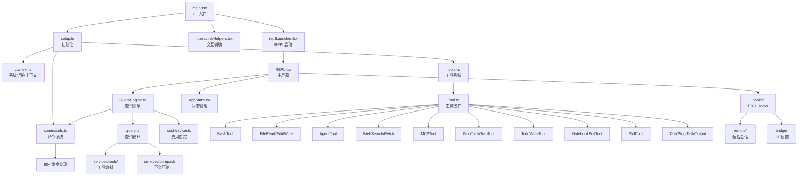
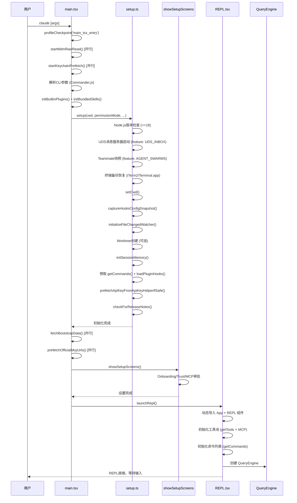

# Claude Code 源码深度分析 - 01 系统架构

## 1. 整体架构概览

Claude Code 是一个基于 React + 自研 Ink 终端渲染引擎的 AI 编程助手 CLI 应用。采用分层架构设计，以 TypeScript 编写，使用 Bun 作为运行时和打包工具。整个应用围绕一个核心的 **查询循环（Query Loop）** 运行，通过 Claude API 实现多轮工具调用驱动的智能编程辅助。

### 架构层次（从上到下）

1. **CLI 入口层** (`main.tsx`) - Commander.js 参数解析，多种入口模式（交互式 REPL、非交互管道、MCP 服务器、助手模式等）
2. **初始化层** (`setup.ts`) - 环境检查、UDS 消息服务器启动、终端备份恢复、Worktree 创建、Hooks 配置、预取
3. **UI 层** (`screens/` + `components/`) - REPL 屏幕、对话框、消息渲染、权限请求、Markdown 渲染
4. **交互层** (`hooks/`) - 100+ React Hooks 连接 UI 和业务逻辑（输入处理、IDE 集成、远程会话、语音等）
5. **引擎层** (`QueryEngine.ts` + `query.ts`) - 核心查询循环、工具编排、上下文压缩、流式响应处理
6. **工具层** (`tools/`) - 30+ 内置工具实现（Bash、文件操作、Web 搜索、Agent、MCP 等）
7. **命令层** (`commands/`) - 90+ 斜杠命令（/commit、/review、/compact、/config 等）
8. **服务层** (`services/`) - Compact（上下文压缩）、Token 计数、MCP 客户端、API 调用、Voice、分析等
9. **基础设施层** (`ink/` + `state/` + `keybindings/` + `migrations/`) - 自研终端渲染、状态管理、快捷键、数据迁移

### 技术栈

| 组件 | 技术选型 |
|------|---------|
| 运行时 | Bun |
| 语言 | TypeScript |
| UI 框架 | React（自研 Ink 终端渲染器） |
| CLI 解析 | Commander.js |
| API 调用 | @anthropic-ai/sdk |
| 协议支持 | MCP (Model Context Protocol) |
| 打包 | bun:bundle（Feature Flag 驱动的 Tree Shaking） |

---

## 2. 核心模块关系图

以下 Mermaid 图展示了 Claude Code 各核心模块之间的调用依赖关系：



### 关键模块说明

| 模块 | 文件 | 职责 |
|------|------|------|
| CLI 入口 | `main.tsx` | 解析命令行参数，协调初始化流程，启动 REPL 或其他模式 |
| 初始化 | `setup.ts` | Node.js 版本检查、UDS 消息服务器、终端备份恢复、CWD 设置、Worktree 创建、Hooks 配置快照、预取 |
| 上下文 | `context.ts` | 构建 System Prompt 和 User Context（Git 状态、Claude.md、Memory 文件等） |
| 交互辅助 | `interactiveHelpers.tsx` | Ink 渲染、对话框显示、Onboarding 流程、设置屏幕 |
| REPL 启动 | `replLauncher.tsx` | 动态导入 App 和 REPL 组件，渲染 React 树 |
| REPL 屏幕 | `screens/REPL.tsx` | 主交互界面，管理消息列表、输入处理、工具权限、命令队列 |
| 查询引擎 | `QueryEngine.ts` | 封装查询生命周期，管理消息历史、工具池、命令列表、费用追踪 |
| 查询循环 | `query.ts` | 核心的 `while(true)` 循环，处理 API 调用、工具执行、上下文压缩、错误恢复 |
| 工具系统 | `tools.ts` + `Tool.ts` | 工具注册、权限过滤、MCP 工具合并、工具接口定义 |
| 命令系统 | `commands.ts` | 命令注册、斜杠命令解析、命令生命周期管理 |
| 状态管理 | `state/AppState.tsx` | 基于 `useSyncExternalStore` 的全局状态，React Context 分发 |
| 费用追踪 | `cost-tracker.ts` | Token 计数、费用计算、会话持久化 |

---

## 3. 应用启动流程

从用户在终端输入 `claude` 命令到 REPL 就绪等待输入的完整流程：



### 启动阶段的关键优化

1. **并行预取**：`startMdmRawRead()`、`startKeychainPrefetch()` 在模块导入阶段就启动，与后续的 CLI 解析并行执行
2. **Feature Flag 驱动**：通过 `bun:bundle` 的 `feature()` 函数实现条件编译，未启用的功能在构建时被 Tree Shaking 移除
3. **延迟导入**：REPL 组件、App 组件通过动态 `import()` 加载，减少首屏加载时间
4. **预取策略**：API Key、命令列表、插件 Hooks、MCP 资源等在后台并行预取

---

## 4. 核心数据流

用户输入到获得响应的完整数据流，展示了消息在系统各层之间的流转过程：

```mermaid
flowchart LR
    Input["用户输入"] --> ProcessInput["processUserInput()"]
    ProcessInput --> SlashCheck{是斜杠命令?}
    SlashCheck -->|是| ExecCmd["执行命令<br/>(commands.ts)"]
    SlashCheck -->|否| SubmitMsg["QueryEngine.submitMessage()"]

    SubmitMsg --> BuildContext["构建上下文<br/>getSystemContext() + getUserContext()"]
    BuildContext --> Attachments["获取附件<br/>Memory文件 + 文件变更通知"]
    Attachments --> APICall["调用Claude API<br/>(deps.callModel)"]
    APICall --> Stream["流式响应处理"]
    Stream --> Response["AssistantMessage"]

    Response --> HasTools{包含工具调用?}

    HasTools -->|否| StopCheck{Stop Hooks?}
    StopCheck -->|阻止继续| Done["输出文本响应"]
    StopCheck -->|通过| BudgetCheck{Token预算检查}
    BudgetCheck -->|超预算| Done
    BudgetCheck -->|通过| Done

    HasTools -->|是| RunTools["runTools() / StreamingToolExecutor"]
    RunTools --> ToolExec["执行各工具<br/>(Bash/FileEdit/WebSearch...)"]
    ToolExec --> ToolResults["收集工具结果"]
    ToolResults --> CompactCheck{上下文压缩检查}
    CompactCheck -->|需要压缩| Compact["autoCompact / reactiveCompact"]
    Compact --> PostCompact["构建压缩后消息"]
    PostCompact --> APICall
    CompactCheck -->|无需压缩| Attachments

    Done --> CostTrack["费用追踪<br/>(cost-tracker.ts)"]
    CostTrack --> Display["渲染到终端<br/>(Ink)"]
```



### 数据流关键节点详解

#### 4.1 输入处理 (`processUserInput`)

位于 `utils/processUserInput/processUserInput.ts`，负责：
- 判断输入是否为斜杠命令
- 解析 `@` 文件引用和图片粘贴
- 处理多行输入和特殊字符
- 将用户输入封装为 `UserMessage`

#### 4.2 上下文构建

- **System Context** (`context.ts:getSystemContext()`): Git 状态、分支信息、CLAUDE.md 文件内容
- **User Context** (`context.ts:getUserContext()`): 当前工作目录、权限模式、环境信息
- **Memory 文件** (`utils/claudemd.ts`): 项目级和用户级 CLAUDE.md 配置
- **附件消息** (`utils/attachments.ts`): 文件变更通知、Memory 文件注入、队列命令

#### 4.3 API 调用

通过 `deps.callModel()` 调用 Claude API，支持：
- 流式响应（Streaming）
- 模型回退（Fallback Model）
- Prompt Caching
- Thinking 模式（扩展思考）
- Fast Mode（快速模式）
- Task Budget（任务预算）

#### 4.4 工具执行

两种执行模式：
- **标准模式**: `runTools()` - 串行执行所有工具
- **流式模式**: `StreamingToolExecutor` - 在 API 流式响应期间并行执行工具

---

## 5. 查询循环详解

`query.ts` 中的核心查询循环是 Claude Code 最重要的代码段。它是一个 `while(true)` 异步生成器循环（第 307 行），每次迭代代表一个完整的 "思考-行动" 周期。

### 循环状态管理

```typescript
type State = {
  messages: Message[]           // 消息历史
  toolUseContext: ToolUseContext // 工具使用上下文
  autoCompactTracking: AutoCompactTrackingState | undefined  // 自动压缩追踪
  maxOutputTokensRecoveryCount: number  // max_output_tokens 恢复计数
  hasAttemptedReactiveCompact: boolean  // 是否已尝试响应式压缩
  maxOutputTokensOverride: number | undefined  // 输出 token 上限覆盖
  pendingToolUseSummary: Promise<...> | undefined  // 待处理的工具使用摘要
  stopHookActive: boolean | undefined  // Stop Hook 是否激活
  turnCount: number  // 当前轮次计数
  transition: Continue | undefined  // 上次迭代的继续原因
}
```

### 单次迭代步骤

```
┌─────────────────────────────────────────────────────────────────┐
│                    queryLoop 单次迭代                            │
├─────────────────────────────────────────────────────────────────┤
│                                                                 │
│  1. 技能发现预取 (Skill Discovery Prefetch)                      │
│     └─ startSkillDiscoveryPrefetch() - 非阻塞启动               │
│                                                                 │
│  2. 查询链追踪初始化 (Query Chain Tracking)                      │
│     └─ chainId + depth 递增，用于分析和调试                      │
│                                                                 │
│  3. 获取 compact boundary 后的消息                                │
│     └─ getMessagesAfterCompactBoundary(messages)                 │
│                                                                 │
│  4. 应用工具结果预算 (Tool Result Budget)                        │
│     └─ applyToolResultBudget() - 限制单条消息的工具结果大小       │
│                                                                 │
│  5. 应用 Snip 压缩 (History Snip)                               │
│     └─ snipCompactIfNeeded() - 裁剪旧消息以释放 token            │
│                                                                 │
│  6. 应用微压缩 (Microcompact)                                   │
│     └─ deps.microcompact() - 压缩缓存编辑结果                    │
│                                                                 │
│  7. 应用上下文折叠 (Context Collapse) [feature gate]             │
│     └─ contextCollapse.applyCollapsesIfNeeded()                 │
│                                                                 │
│  8. 自动压缩检查 (Autocompact)                                  │
│     └─ deps.autocompact() - token 超阈值时自动压缩上下文         │
│                                                                 │
│  9. Token 阻塞限制检查 (Blocking Limit)                          │
│     └─ 超过硬限制时返回错误，阻止继续                             │
│                                                                 │
│ 10. 调用 Claude API (Streaming)                                 │
│     └─ deps.callModel() - 流式获取模型响应                      │
│     └─ 支持 Fallback Model 重试                                 │
│                                                                 │
│ 11. 执行工具 (Run Tools)                                        │
│     └─ runTools() 或 StreamingToolExecutor                      │
│                                                                 │
│ 12. 收集附件 (Attachments)                                      │
│     └─ Memory 文件 + 文件变更通知 + 队列命令 + 技能发现结果       │
│                                                                 │
│ 13. 处理 Stop Hooks                                             │
│     └─ handleStopHooks() - 检查是否允许继续                     │
│                                                                 │
│ 14. 处理 max_output_tokens 恢复                                 │
│     └─ 升级到 64k 或注入恢复消息（最多 3 次）                    │
│                                                                 │
│ 15. 处理 Prompt Too Long 恢复                                   │
│     └─ Context Collapse drain → Reactive Compact                 │
│                                                                 │
│ 16. Token 预算检查 (Token Budget) [feature gate]                │
│     └─ checkTokenBudget() - 超预算时注入 nudge 消息或终止        │
│                                                                 │
│ 17. 更新状态，continue 进入下一次迭代                             │
│                                                                 │
└─────────────────────────────────────────────────────────────────┘
```

### 循环退出条件

查询循环在以下情况下退出（`return` 而非 `continue`）：

| 退出原因 | 条件 |
|---------|------|
| `completed` | 模型返回纯文本响应（无工具调用），Stop Hooks 通过 |
| `aborted_streaming` | 用户在 API 流式响应期间中断（Ctrl+C） |
| `aborted_tools` | 用户在工具执行期间中断 |
| `stop_hook_prevented` | Stop Hook 阻止继续 |
| `hook_stopped` | Hook 指示停止继续 |
| `prompt_too_long` | 上下文过长且压缩恢复失败 |
| `blocking_limit` | 超过 Token 阻塞限制 |
| `model_error` | API 调用异常 |
| `image_error` | 图片大小/处理错误 |
| `max_turns_reached` | 达到最大轮次限制 |

### 关键恢复机制

#### max_output_tokens 恢复（最多 3 次）

```
第 1 次: 升级到 ESCALATED_MAX_TOKENS (64k) [feature gate: tengu_otk_slot_v1]
第 2 次: 注入恢复消息 "Resume directly, no apology..."
第 3 次: 再次注入恢复消息
第 4 次: 放弃恢复，返回错误
```

#### Prompt Too Long 恢复链

```
Context Collapse drain (尝试释放已折叠的上下文)
    ↓ 失败
Reactive Compact (完整摘要压缩)
    ↓ 失败
返回错误
```

---

## 6. 模块通信机制

### 6.1 状态管理

Claude Code 使用 **自定义 Store + React Context** 的状态管理方案：

- **AppState** (`state/AppState.tsx`): 基于 `useSyncExternalStore` 实现的全局状态存储
- **AppStateProvider**: 通过 React Context 向组件树分发状态
- **Store** (`state/store.ts`): 轻量级发布-订阅模式，支持 `getState()`、`setState()`、`subscribe()`
- **Selectors** (`state/selectors.ts`): 派生状态计算

关键状态字段包括：
- 工具权限上下文 (`toolPermissionContext`)
- MCP 连接状态 (`mcp`)
- 费用状态 (`costState`)
- 快速模式 (`fastMode`)
- 努力程度 (`effortValue`)
- 顾问模型 (`advisorModel`)

### 6.2 事件系统

- **自定义事件发射器**: 用于模块间松耦合通信
- **React Hooks**: 作为事件系统的消费者，将状态变化转化为 UI 更新
- **命令生命周期** (`utils/commandLifecycle.ts`): 追踪斜杠命令的 started/completed 状态
- **分析事件** (`services/analytics/index.js`): `logEvent()` 发送遥测数据

### 6.3 进程间通信

- **UDS (Unix Domain Socket)**: 消息服务器 (`utils/udsMessaging.ts`)，用于进程间消息传递
  - 仅在非 `--bare` 模式下启动
  - 通过 `CLAUDE_CODE_MESSAGING_SOCKET` 环境变量暴露 socket 路径
  - 支持 `--messaging-socket-path` 自定义路径

### 6.4 远程通信

- **WebSocket**: 远程会话管理 (`remote/SessionsWebSocket.ts`)
- **HTTP POST**: 远程权限桥接 (`remote/remotePermissionBridge.ts`)
- **SDK 消息适配器** (`remote/sdkMessageAdapter.ts`): 将内部消息格式转换为 SDK 兼容格式

### 6.5 IDE 通信

- **Bridge REST API**: IDE 集成桥接 (`hooks/useReplBridge.tsx`)
- **WebSocket**: 实时双向通信
- **IDE 连接状态** (`hooks/useIdeConnectionStatus.ts`): 监控 IDE 连接状态
- **IDE 选择内容** (`hooks/useIdeSelection.ts`): 获取 IDE 中的选中文本

---

## 7. 入口模式

Claude Code 通过 Commander.js 支持多种入口模式，在 `main.tsx` 中定义：

### 7.1 交互式 REPL（默认模式）

```bash
claude
```

- 启动完整的 Ink 终端 UI
- 显示 REPL 屏幕，等待用户输入
- 支持所有工具、命令和 Hooks
- 完整的权限管理系统

### 7.2 非交互模式（管道模式）

```bash
claude -p "your prompt"
echo "prompt" | claude -p
```

- 通过 `-p` / `--print` 参数启用
- 单次查询后退出
- 适合脚本集成和 CI/CD
- 输出纯文本或 JSON（`--output-format json`）

### 7.3 MCP 服务器模式

```bash
claude mcp serve
```

- 将 Claude Code 作为 MCP 服务器运行
- 暴露工具和资源给 MCP 客户端
- 通过 stdio 或 SSE 传输

### 7.4 助手模式

```bash
claude assistant
```

- 通过 Feature Flag `KAIROS` 控制
- 提供持久化的助手会话
- 支持后台任务和推送通知

### 7.5 打开网页

```bash
claude open
```

- 在浏览器中打开 Claude Code 网页界面

### 7.6 SSH 远程模式

```bash
claude ssh
```

- 通过 SSH 连接远程环境
- 支持远程会话管理
- `hooks/useSSHSession.ts` 管理连接生命周期

### 7.7 Direct Connect 模式

```bash
claude direct-connect
```

- 直接连接到 Anthropic 后端
- `hooks/useDirectConnect.ts` 管理连接

### 7.8 --bare 模式

```bash
claude --bare
```

- 精简模式，跳过 UDS 消息服务器、Teammate 快照
- 不加载插件 Hooks、不启动后台分析任务
- 适用于脚本化和自动化场景

### 7.9 Worktree 模式

```bash
claude --worktree [--tmux]
```

- 为每个会话创建 Git Worktree
- 可选创建 Tmux 会话
- 支持 PR 编号关联的 Worktree

---

## 附录：关键文件索引

| 文件路径 | 说明 |
|---------|------|
| `src/main.tsx` | CLI 入口，Commander.js 配置 |
| `src/setup.ts` | 应用初始化逻辑 |
| `src/context.ts` | System/User 上下文构建 |
| `src/interactiveHelpers.tsx` | Ink 渲染辅助、对话框、设置屏幕 |
| `src/dialogLaunchers.tsx` | 各类对话框启动器 |
| `src/replLauncher.tsx` | REPL 启动器 |
| `src/screens/REPL.tsx` | 主 REPL 屏幕组件 |
| `src/components/App.tsx` | 应用根组件 |
| `src/QueryEngine.ts` | 查询引擎，封装查询生命周期 |
| `src/query.ts` | 核心查询循环 (while true) |
| `src/Tool.ts` | 工具接口定义 |
| `src/tools.ts` | 工具注册和合并 |
| `src/commands.ts` | 命令注册和管理 |
| `src/cost-tracker.ts` | 费用追踪 |
| `src/state/AppState.tsx` | 全局状态管理 |
| `src/state/store.ts` | 轻量级 Store 实现 |
| `src/ink/` | 自研终端渲染引擎 |
| `src/hooks/` | 100+ React Hooks |
| `src/services/compact/` | 上下文压缩服务 |
| `src/services/tools/` | 工具编排服务 |
| `src/services/mcp/` | MCP 客户端 |
| `src/services/api/` | Claude API 调用 |
| `src/remote/` | 远程会话管理 |
| `src/keybindings/` | 快捷键系统 |
| `src/migrations/` | 数据迁移 |
| `src/utils/` | 通用工具函数（300+ 文件） |
