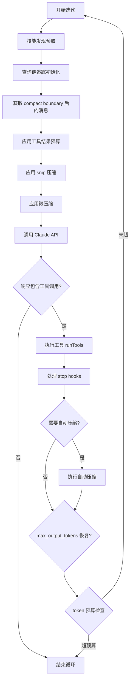

# Claude Code 源码深度分析 - 02 核心引擎

## 1. QueryEngine 查询引擎

### 1.1 类定义与职责

QueryEngine 是管理单个会话完整生命周期的核心类，位于 `src/QueryEngine.ts`（1295行）。它承担了以下核心职责：

- **会话生命周期管理**：从用户消息提交到查询完成的全流程控制
- **消息历史维护**：管理对话上下文中的所有消息
- **工具权限协调**：通过 `canUseTool` 回调与权限系统交互
- **中止控制**：通过 `AbortController` 支持查询中断
- **用量追踪**：记录 token 消耗、费用和权限拒绝事件
- **模型切换**：支持在会话中动态切换底层模型

QueryEngine 作为 Claude Code 架构中的"指挥中心"，将用户输入、上下文构建、API 调用、工具执行和结果呈现串联为一个完整的交互循环。

### 1.2 QueryEngineConfig 配置接口

```typescript
interface QueryEngineConfig {
  cwd: string
  tools: Tools
  commands: Command[]
  mcpClients?: MCPServerConnection[]
  agents?: AgentDefinition[]
  canUseTool: (toolName: string, input: unknown) => Promise<boolean>
  getAppState: () => AppState
  setAppState: (update: Partial<AppState>) => void
  // ... 更多配置
}
```

该配置接口定义了 QueryEngine 运行所需的全部依赖：

| 配置项 | 类型 | 说明 |
|--------|------|------|
| `cwd` | `string` | 当前工作目录，作为所有文件操作的根路径 |
| `tools` | `Tools` | 可用工具集合，包含所有已注册的工具定义 |
| `commands` | `Command[]` | 斜杠命令列表，用于扩展交互能力 |
| `mcpClients` | `MCPServerConnection[]`（可选） | MCP（Model Context Protocol）服务器连接，用于外部工具集成 |
| `agents` | `AgentDefinition[]`（可选） | 子代理定义，支持多代理协作模式 |
| `canUseTool` | `(toolName, input) => Promise<boolean>` | 工具权限检查回调，在每次工具调用前触发 |
| `getAppState` | `() => AppState` | 获取应用状态的函数 |
| `setAppState` | `(update: Partial<AppState>) => void` | 更新应用状态的函数 |

### 1.3 核心方法

#### `constructor(config)`

初始化 QueryEngine 实例，完成以下准备工作：

- **消息数组初始化**：创建空的消息历史数组，用于存储对话上下文
- **中止控制器创建**：实例化 `AbortController`，为后续中断操作提供信号源
- **权限拒绝追踪**：初始化权限拒绝计数器，用于统计被用户拒绝的工具调用次数
- **文件缓存建立**：创建文件内容缓存，避免重复读取同一文件

```typescript
constructor(config: QueryEngineConfig) {
  this.config = config
  this.messages = []
  this.abortController = new AbortController()
  this.permissionDenials = []
  this.fileCache = new Map()
  // ... 其他初始化逻辑
}
```

#### `async *submitMessage(prompt, options)` — 异步生成器

这是 QueryEngine 最核心的方法，以异步生成器（Async Generator）的形式实现，提交用户消息并启动查询循环。其执行流程如下：

1. **构建 ProcessUserInputContext 上下文**：将当前会话状态、工具配置、权限回调等封装为统一的上下文对象
2. **调用 `processUserInput()` 处理用户输入**：解析并处理斜杠命令（如 `/help`、`/model` 等），如果是普通文本则直接进入查询流程
3. **调用 `query()` 执行 API 查询循环**：这是实际与 Claude API 交互的核心循环
4. **追踪用量**：累计记录 `totalUsage`（token 消耗）、`permissionDenials`（权限拒绝次数）
5. **处理边界条件**：
   - **compact boundary**：当上下文窗口接近极限时触发自动压缩
   - **max_turns**：达到最大轮次限制时终止循环
   - **max_budget**：达到预算上限时终止循环

```typescript
async *submitMessage(prompt: string, options?: SubmitMessageOptions): AsyncGenerator<QueryResponse> {
  // 1. 构建上下文
  const context = this.buildProcessUserInputContext()

  // 2. 处理用户输入（含斜杠命令）
  const processedInput = await processUserInput(prompt, context)

  // 3. 如果是斜杠命令，直接返回结果
  if (processedInput.isCommand) {
    yield processedInput.response
    return
  }

  // 4. 执行查询循环
  for await (const response of this.query(processedInput.messages, context)) {
    // 追踪用量
    this.totalUsage = accumulateUsage(this.totalUsage, response.usage)

    // 检查边界条件
    if (this.shouldStop(response)) {
      yield response
      break
    }

    yield response
  }
}
```

#### `interrupt()`

中止当前正在执行的查询。通过向 `AbortController` 发送中止信号，中断 API 调用和工具执行：

```typescript
interrupt(): void {
  this.abortController.abort()
}
```

#### `getMessages()`

获取当前会话的完整消息历史，返回消息数组的副本以避免外部修改：

```typescript
getMessages(): Message[] {
  return [...this.messages]
}
```

#### `setModel(model)`

动态切换底层模型，无需重启会话即可切换到不同的 Claude 模型版本：

```typescript
setModel(model: string): void {
  this.config.model = model
}
```

### 1.4 `ask()` 便捷函数

`ask()` 是一个一次性查询包装器，简化了单次查询的使用模式。它内部创建一个临时的 QueryEngine 实例，调用 `submitMessage()`，并在查询完成后自动清理资源：

```typescript
async function ask(prompt: string, options?: AskOptions): Promise<QueryResponse> {
  const engine = new QueryEngine(options?.config)
  const results = []
  for await (const response of engine.submitMessage(prompt, options)) {
    results.push(response)
  }
  return results[results.length - 1]
}
```

适用场景：
- 脚本化调用 Claude Code
- 单次问答场景
- 测试和调试

---

## 2. 查询循环 (query.ts)

### 2.1 QueryParams 参数

查询循环的入口函数接收 `QueryParams` 对象，定义了执行查询所需的全部参数：

```typescript
interface QueryParams {
  messages: Message[]           // 消息历史（包含对话上下文）
  systemPrompt: string          // 系统提示词
  userContext: string           // 用户上下文（CLAUDE.md 等）
  systemContext: string         // 系统上下文（Git 信息等）
  canUseTool: (toolName: string, input: unknown) => Promise<boolean>  // 工具权限检查
  toolUseContext: ToolUseContext // 工具使用上下文
  fallbackModel?: string        // 备用模型（当主模型不可用时）
  querySource: QuerySource      // 查询来源（标识触发方式）
  maxOutputTokensOverride?: number  // 最大输出 token 覆盖值
  maxTurns?: number             // 最大轮次限制
  taskBudget?: TaskBudget       // 任务预算（token 和费用限制）
  deps?: QueryDeps              // 依赖注入（用于测试）
}
```

参数说明：

| 参数 | 说明 |
|------|------|
| `messages` | 包含完整对话历史的消息数组，是上下文窗口管理的核心对象 |
| `systemPrompt` | 系统级提示词，定义 Claude 的行为规范和能力边界 |
| `userContext` | 用户自定义上下文，通常来自 CLAUDE.md 文件 |
| `systemContext` | 自动收集的系统信息，如 Git 状态、工作目录等 |
| `canUseTool` | 权限检查函数，每次工具调用前都会触发 |
| `toolUseContext` | 工具使用的上下文信息，包含工具定义和状态 |
| `fallbackModel` | 当主模型返回错误时的降级模型 |
| `querySource` | 标识查询的触发来源（用户输入、自动补全等） |
| `maxOutputTokensOverride` | 覆盖默认的最大输出 token 数 |
| `maxTurns` | 限制查询循环的最大迭代次数 |
| `taskBudget` | 任务级别的 token 和费用预算 |
| `deps` | 依赖注入接口，主要用于单元测试中模拟外部依赖 |

### 2.2 核心循环 (queryLoop)

查询循环是 Claude Code 的"心脏"，通过不断迭代实现 Claude 与工具之间的多轮交互。以下是其完整流程：



**各阶段详解：**

1. **技能发现预取（Skill Prefetch）**：在查询开始前，预先发现和加载可能需要的技能（如 MCP 工具），减少后续延迟
2. **查询链追踪初始化**：为当前查询建立追踪上下文，用于调试和日志记录
3. **获取 compact boundary 后的消息**：从完整消息历史中截取最近的有效消息，避免上下文窗口溢出
4. **应用工具结果预算**：限制工具返回结果的大小，防止单次工具调用消耗过多上下文
5. **应用 snip 压缩**：对过长的消息内容进行智能裁剪，保留关键信息
6. **应用微压缩**：对消息进行轻量级压缩，进一步节省上下文空间
7. **调用 Claude API**：将处理后的消息发送给 Claude API，获取响应
8. **工具调用判断**：检查响应中是否包含工具调用请求
9. **工具执行**：解析并执行 Claude 请求的工具调用
10. **Stop Hooks 处理**：在工具执行完成后触发注册的钩子函数
11. **自动压缩判断**：评估是否需要对上下文进行压缩
12. **Token 预算检查**：检查累计 token 消耗是否超过预算限制

### 2.3 工具执行 (runTools)

`runTools` 函数负责执行 Claude 返回的工具调用请求，是查询循环中最复杂的环节之一。

#### 工具调用解析与分发

Claude API 返回的工具调用以结构化格式呈现，`runTools` 需要解析这些调用并分发到对应的工具处理器：

```typescript
async function runTools(
  toolUses: ToolUse[],
  context: ToolExecutionContext
): Promise<ToolResult[]> {
  const results: ToolResult[] = []

  for (const toolUse of toolUses) {
    const tool = findTool(toolUse.name, context.tools)
    if (!tool) {
      results.push(createErrorResult(toolUse, `Unknown tool: ${toolUse.name}`))
      continue
    }

    const result = await executeTool(tool, toolUse.input, context)
    results.push(result)
  }

  return results
}
```

#### 并发控制 (isConcurrencySafe)

并非所有工具都可以安全地并发执行。通过 `isConcurrencySafe` 标志区分：

- **并发安全工具**：如文件读取（Read）、搜索（Grep/Glob），可以同时执行多个
- **非并发安全工具**：如文件写入（Write）、命令执行（Bash），必须串行执行以避免竞态条件

```typescript
// 并发安全的工具可以并行执行
const safeTools = toolUses.filter(t => isConcurrencySafe(t.name))
const unsafeTools = toolUses.filter(t => !isConcurrencySafe(t.name))

// 先执行并发安全工具
const safeResults = await Promise.all(safeTools.map(t => executeTool(t)))

// 再串行执行非并发安全工具
const unsafeResults = []
for (const tool of unsafeTools) {
  unsafeResults.push(await executeTool(tool))
}
```

#### 权限检查与用户确认

每次工具调用前都需要经过权限检查流程：

1. **自动允许**：对于低风险工具（如读取文件），自动放行
2. **用户确认**：对于高风险工具（如执行命令、写入文件），暂停执行并等待用户确认
3. **权限拒绝**：用户拒绝后，记录拒绝事件并返回错误结果给 Claude

```typescript
async function checkPermission(
  toolName: string,
  input: unknown,
  canUseTool: (name: string, input: unknown) => Promise<boolean>
): Promise<PermissionResult> {
  const allowed = await canUseTool(toolName, input)
  if (!allowed) {
    return { allowed: false, reason: 'User denied permission' }
  }
  return { allowed: true }
}
```

#### 进度报告

工具执行过程中会实时报告进度信息，包括：

- 当前正在执行的工具名称
- 工具执行的开始/结束状态
- 执行耗时
- 中间输出（对于长时间运行的工具）

#### 错误处理与重试

工具执行失败时的处理策略：

- **可重试错误**：如网络超时、速率限制，自动重试（带指数退避）
- **不可重试错误**：如权限不足、参数无效，直接返回错误结果
- **超时处理**：长时间未响应的工具调用会被强制终止

---

## 3. 上下文系统 (context.ts)

上下文系统负责为 Claude API 调用构建完整的上下文信息，是理解 Claude Code 如何"感知"项目环境的关键。

### 3.1 系统上下文 (getSystemContext)

系统上下文通过 `getSystemContext()` 函数自动收集项目环境信息：

#### memoize 缓存

系统上下文的获取开销较大（涉及 Git 命令等），因此使用 `memoize` 进行缓存，在同一会话中只计算一次：

```typescript
const getSystemContext = memoize(async (cwd: string): Promise<string> => {
  // 收集系统上下文信息
  const gitInfo = await collectGitInfo(cwd)
  return formatSystemContext(gitInfo)
})
```

#### Git 状态信息

系统上下文的核心内容是 Git 仓库的状态信息：

| 信息项 | 来源 | 说明 |
|--------|------|------|
| 分支名 | `git branch --show-current` | 当前所在分支 |
| 主分支 | `git symbolic-ref refs/remotes/origin/HEAD` | 远程默认分支 |
| 状态 | `git status --porcelain` | 工作区变更状态 |
| 最近提交 | `git log --oneline -5` | 最近 5 条提交记录 |
| 用户名 | `git config user.name` | Git 配置的用户名 |

#### 超过 2000 字符截断

为防止系统上下文占用过多上下文窗口空间，当系统上下文超过 2000 字符时进行截断处理，保留最关键的信息：

```typescript
function truncateSystemContext(context: string, maxLength: number = 2000): string {
  if (context.length <= maxLength) {
    return context
  }
  return context.substring(0, maxLength) + '\n... (truncated)'
}
```

### 3.2 用户上下文 (getUserContext)

用户上下文通过 `getUserContext()` 函数收集用户自定义的项目信息：

#### CLAUDE.md 文件内容

`CLAUDE.md` 是 Claude Code 的项目级配置文件，用于向 Claude 提供项目特定的指令和上下文。系统会按以下优先级查找：

1. `./CLAUDE.md` — 项目根目录
2. `./.claude/CLAUDE.md` — `.claude` 目录下
3. 父目录中的 `CLAUDE.md`（向上递归查找）

```typescript
async function getUserContext(cwd: string): Promise<string> {
  if (process.env.CLAUDE_CODE_DISABLE_CLAUDE_MDS) {
    return ''
  }

  const claudeMdPaths = [
    path.join(cwd, 'CLAUDE.md'),
    path.join(cwd, '.claude', 'CLAUDE.md'),
  ]

  const contents = []
  for (const filePath of claudeMdPaths) {
    if (await fileExists(filePath)) {
      contents.push(await readFile(filePath, 'utf-8'))
    }
  }

  return contents.join('\n\n')
}
```

#### 当前日期

自动注入当前日期信息，帮助 Claude 理解时间上下文：

```typescript
const dateContext = `Current date: ${new Date().toISOString().split('T')[0]}`
```

#### 可通过 CLAUDE_CODE_DISABLE_CLAUDE_MDS 禁用

设置环境变量 `CLAUDE_CODE_DISABLE_CLAUDE_MDS=1` 可以完全禁用 CLAUDE.md 文件的加载，适用于需要最小化上下文的场景。

### 3.3 系统提示注入

#### getSystemPromptInjection() / setSystemPromptInjection()

系统提示注入机制提供了一种动态修改系统提示的方式：

```typescript
let systemPromptInjection: string | undefined

function getSystemPromptInjection(): string | undefined {
  return systemPromptInjection
}

function setSystemPromptInjection(injection: string | undefined): void {
  systemPromptInjection = injection
}
```

#### 用于缓存破坏

该机制的主要用途是**缓存破坏（Cache Busting）**。当系统提示需要动态更新时（例如用户修改了 CLAUDE.md），通过修改注入值可以使 memoize 缓存失效，确保下次查询使用最新的上下文：

```typescript
// 当 CLAUDE.md 文件变更时
watchFile('CLAUDE.md', () => {
  setSystemPromptInjection(`cache-bust-${Date.now()}`)
})
```

---

## 4. 消息系统

消息系统定义了 Claude Code 中信息的表示、处理和渲染方式。

### 4.1 消息类型

Claude Code 定义了以下核心消息类型：

| 类型 | 说明 | 典型内容 |
|------|------|----------|
| `UserMessage` | 用户发送的消息 | 文本输入、文件附件、图片 |
| `AssistantMessage` | Claude 的响应 | 文本回复、工具调用请求、思考过程 |
| `SystemMessage` | 系统级消息 | 压缩边界标记、系统提示 |
| `AttachmentMessage` | 附件消息 | 上传的文件或图片 |
| `GroupedToolUseMessage` | 分组的工具调用消息 | 多个相关工具调用的聚合展示 |
| `CollapsedReadSearchGroupMessage` | 折叠的读取/搜索分组 | 多个文件读取或搜索操作的压缩展示 |

**AssistantMessage 的子类型：**

AssistantMessage 内部包含多种内容块（content block）：

- `text` — 纯文本回复
- `tool_use` — 工具调用请求
- `thinking` — 扩展思考过程（Extended Thinking）
- `redacted_thinking` — 已编辑的思考内容
- `server_tool_use` — 服务端工具调用

### 4.2 消息处理管线

在 `Messages.tsx` 中，消息经过多层处理管线后才进行渲染：

#### 1. normalizeMessages — 标准化消息格式

将各种来源的消息统一为标准格式，处理边缘情况（如空消息、格式不一致等）：

```typescript
function normalizeMessages(messages: RawMessage[]): Message[] {
  return messages
    .filter(msg => msg != null && msg.content?.length > 0)
    .map(msg => ({
      ...msg,
      content: normalizeContent(msg.content),
      timestamp: msg.timestamp ?? Date.now(),
    }))
}
```

#### 2. reorderMessagesInUI — UI 重新排序

根据 UI 展示需求对消息进行重新排序，例如将系统消息移至适当位置、确保消息的时间顺序正确。

#### 3. applyGrouping — 消息分组

将连续的同类消息进行分组，减少视觉噪音：

- 连续的文件读取操作合并为一个 `CollapsedReadSearchGroupMessage`
- 连续的工具调用合并为一个 `GroupedToolUseMessage`
- 相关的系统消息进行聚合

#### 4. 多层 collapse — 多层折叠

消息处理管线包含多层折叠逻辑，用于压缩冗余信息：

| 折叠层 | 目标 | 说明 |
|--------|------|------|
| 背景 Bash 通知 | 后台命令输出 | 将后台 Bash 命令的输出折叠为摘要 |
| Hook 摘要 | 钩子执行结果 | 将钩子函数的输出折叠为简要信息 |
| Teammate 关闭 | 子代理完成 | 将子代理的关闭消息折叠 |
| Read/Search 分组 | 文件读取和搜索 | 将多个连续的读取/搜索操作折叠为一个分组 |

```typescript
function applyCollapses(messages: Message[]): Message[] {
  let result = collapseBackgroundBashNotifications(messages)
  result = collapseHookSummaries(result)
  result = collapseTeammateClosures(result)
  result = collapseReadSearchGroups(result)
  return result
}
```

### 4.3 消息渲染路由

在 `Message.tsx` 中，通过 `switch(message.type)` 将消息分发到对应的渲染组件：

```typescript
function Message({ message }: { message: Message }) {
  switch (message.type) {
    case 'attachment':
      return <AttachmentMessage message={message} />

    case 'assistant':
      return <AssistantMessageBlock message={message} />
      // 内部按 content block 类型分发:
      // - text -> TextBlock
      // - tool_use -> ToolUseBlock
      // - thinking -> ThinkingBlock
      // - redacted_thinking -> RedactedThinkingBlock
      // - server_tool_use -> ServerToolUseBlock

    case 'user':
      // 检查是否为压缩摘要
      if (isCompactSummary(message)) {
        return <CompactSummary message={message} />
      }
      // 按 content block 类型分发
      return <UserMessageContent message={message} />

    case 'system':
      // 按系统消息子类型分发:
      // - compact_boundary -> CompactBoundaryMessage
      // - snip_boundary -> SnipBoundaryMessage
      // - 其他 -> SystemTextMessage
      return <SystemMessageRouter message={message} />

    case 'grouped_tool_use':
      return <GroupedToolUseContent message={message} />

    case 'collapsed_read_search':
      return <CollapsedReadSearchContent message={message} />

    default:
      return null
  }
}
```

**渲染路由总结：**

| 消息类型 | 渲染组件 | 说明 |
|----------|----------|------|
| `attachment` | `AttachmentMessage` | 文件/图片附件展示 |
| `assistant` | `AssistantMessageBlock` | 按 content block 细分渲染 |
| `assistant.text` | `TextBlock` | 文本回复渲染 |
| `assistant.tool_use` | `ToolUseBlock` | 工具调用展示（含输入/输出） |
| `assistant.thinking` | `ThinkingBlock` | 扩展思考过程展示 |
| `assistant.redacted_thinking` | `RedactedThinkingBlock` | 已编辑思考内容 |
| `assistant.server_tool_use` | `ServerToolUseBlock` | 服务端工具调用 |
| `user` | `CompactSummary` 或 `UserMessageContent` | 用户消息（含压缩摘要判断） |
| `system` | `CompactBoundaryMessage` / `SnipBoundaryMessage` / `SystemTextMessage` | 系统消息路由 |
| `grouped_tool_use` | `GroupedToolUseContent` | 分组工具调用展示 |
| `collapsed_read_search` | `CollapsedReadSearchContent` | 折叠的读取/搜索分组 |

---

## 5. 费用追踪 (cost-tracker.ts)

费用追踪系统负责精确记录和持久化 Claude Code 使用过程中产生的所有费用和资源消耗。

### 5.1 追踪维度

费用追踪系统从多个维度记录使用情况：

| 维度 | 说明 | 单位 |
|------|------|------|
| 总费用 (USD) | 累计 API 调用费用 | 美元 |
| 总持续时间 | 从会话开始到结束的总时间 | 秒 |
| API 持续时间 | 实际 API 调用耗时（排除本地处理） | 秒 |
| 输入 token 数 | 发送给 API 的输入 token 总量 | tokens |
| 输出 token 数 | API 返回的输出 token 总量 | tokens |
| 缓存读取 token 数 | 通过 Prompt Caching 读取的 token 数 | tokens |
| 缓存创建 token 数 | 新创建的缓存 token 数 | tokens |
| 代码变更行数 (added) | 新增的代码行数 | 行 |
| 代码变更行数 (removed) | 删除的代码行数 | 行 |
| Web 搜索请求数 | 发起的 Web 搜索次数 | 次 |
| 按模型分类的用量 | 每个模型的独立用量统计 | — |

```typescript
interface CostState {
  totalCostUSD: number
  totalDurationMs: number
  apiDurationMs: number
  inputTokens: number
  outputTokens: number
  cacheReadTokens: number
  cacheCreationTokens: number
  codeLinesAdded: number
  codeLinesRemoved: number
  webSearchRequests: number
  modelUsage: Record<string, ModelUsage>
}
```

### 5.2 持久化

费用数据通过三个核心函数实现持久化管理：

#### saveCurrentSessionCosts()

将当前会话的费用数据保存到项目配置中，确保会话结束后数据不丢失：

```typescript
function saveCurrentSessionCosts(
  sessionId: string,
  costs: CostState,
  projectDir: string
): void {
  const configPath = getProjectConfigPath(projectDir)
  const config = readProjectConfig(configPath)
  config.sessionCosts[sessionId] = costs
  writeProjectConfig(configPath, config)
}
```

#### restoreCostStateForSession()

从持久化存储中恢复指定会话的费用状态，用于会话恢复场景：

```typescript
function restoreCostStateForSession(
  sessionId: string,
  projectDir: string
): CostState | null {
  const config = readProjectConfig(getProjectConfigPath(projectDir))
  return config.sessionCosts[sessionId] ?? null
}
```

#### getStoredSessionCosts()

读取所有已存储的会话费用数据，用于历史查询和统计：

```typescript
function getStoredSessionCosts(projectDir: string): Record<string, CostState> {
  const config = readProjectConfig(getProjectConfigPath(projectDir))
  return config.sessionCosts ?? {}
}
```

### 5.3 addToTotalSessionCost() 核心函数

`addToTotalSessionCost()` 是费用累加的核心函数，其特殊之处在于需要**递归处理 advisor 用量**：

```typescript
function addToTotalSessionCost(
  total: CostState,
  addition: CostState | AdvisorUsage
): CostState {
  // 处理直接费用累加
  if ('totalCostUSD' in addition) {
    return {
      ...total,
      totalCostUSD: total.totalCostUSD + addition.totalCostUSD,
      inputTokens: total.inputTokens + addition.inputTokens,
      outputTokens: total.outputTokens + addition.outputTokens,
      cacheReadTokens: total.cacheReadTokens + addition.cacheReadTokens,
      cacheCreationTokens: total.cacheCreationTokens + addition.cacheCreationTokens,
      // ... 其他维度
    }
  }

  // 递归处理 advisor（子代理）用量
  if ('advisorUsage' in addition) {
    let result = { ...total }
    for (const advisorCost of addition.advisorUsage) {
      result = addToTotalSessionCost(result, advisorCost)
    }
    return result
  }

  return total
}
```

递归处理的必要性在于：Claude Code 支持多代理架构，主代理可以启动子代理（advisor），子代理也可能进一步启动更深层级的代理。费用追踪需要将所有层级的消耗汇总到会话总费用中。

---

## 6. 历史记录系统 (history.ts)

历史记录系统管理 Claude Code 的对话历史，支持会话恢复和历史搜索。

### 存储位置与格式

历史记录存储在用户主目录下的 `~/.claude/history.jsonl` 文件中，采用 JSONL（JSON Lines）格式——每行一个独立的 JSON 对象，便于追加写入和流式读取：

```jsonl
{"id":"sess_001","timestamp":1712000000000,"messages":[...],"cost":{...}}
{"id":"sess_002","timestamp":1712000100000,"messages":[...],"cost":{...}}
{"id":"sess_003","timestamp":1712000200000,"messages":[...],"cost":{...}}
```

### 文件锁保证并发安全

由于多个 Claude Code 实例可能同时运行（例如多个终端窗口），历史记录文件需要并发访问保护。系统使用文件锁（file lock）机制确保写入操作的原子性：

```typescript
async function appendHistoryEntry(entry: HistoryEntry): Promise<void> {
  const lockPath = HISTORY_PATH + '.lock'
  const lock = await acquireLock(lockPath)

  try {
    await appendFile(HISTORY_PATH, JSON.stringify(entry) + '\n')
  } finally {
    await releaseLock(lock)
  }
}
```

### 大文本粘贴内容的外部存储

当用户粘贴大段文本时，直接存储在历史记录中会导致文件膨胀。系统采用**外部 paste store** 策略：

1. 计算粘贴内容的哈希值
2. 将内容存储到外部文件 `~/.claude/pastes/<hash>`
3. 在历史记录中仅保存哈希引用

```typescript
interface PasteReference {
  type: 'paste_ref'
  hash: string
  preview: string  // 前 100 字符预览
}

function storePasteContent(content: string): PasteReference {
  const hash = computeHash(content)
  const pastePath = path.join(PASTE_STORE_DIR, hash)

  if (!fileExists(pastePath)) {
    writeFileSync(pastePath, content)
  }

  return {
    type: 'paste_ref',
    hash,
    preview: content.substring(0, 100),
  }
}
```

### 待写入条目的内存缓冲与异步刷盘

为了避免频繁的磁盘 I/O 影响交互响应速度，历史记录系统采用内存缓冲 + 异步刷盘策略：

1. 新的历史条目先写入内存缓冲区
2. 通过定时器或缓冲区满时触发异步刷盘
3. 进程退出前确保缓冲区完全刷盘

```typescript
class HistoryBuffer {
  private buffer: HistoryEntry[] = []
  private flushTimer: NodeJS.Timer | null = null

  add(entry: HistoryEntry): void {
    this.buffer.push(entry)

    // 缓冲区满或首次添加时启动定时刷盘
    if (this.buffer.length >= FLUSH_THRESHOLD || !this.flushTimer) {
      this.scheduleFlush()
    }
  }

  private scheduleFlush(): void {
    if (this.flushTimer) return
    this.flushTimer = setTimeout(() => this.flush(), FLUSH_INTERVAL)
  }

  private async flush(): Promise<void> {
    this.flushTimer = null
    if (this.buffer.length === 0) return

    const entries = [...this.buffer]
    this.buffer = []

    await appendHistoryEntries(entries)
  }

  async drain(): Promise<void> {
    // 进程退出前调用，确保所有数据持久化
    clearInterval(this.flushTimer)
    await this.flush()
  }
}
```

### 最多保留 100 条历史记录

为控制存储空间，历史记录系统限制最多保留 100 条记录。超出时自动淘汰最旧的记录：

```typescript
async function pruneHistory(): Promise<void> {
  const entries = await readAllHistory()
  if (entries.length > MAX_HISTORY_ENTRIES) {
    const pruned = entries.slice(entries.length - MAX_HISTORY_ENTRIES)
    await rewriteHistory(pruned)
  }
}
```

### 时间戳搜索 (Ctrl+R)

历史记录系统支持通过 `Ctrl+R` 快捷键触发的时间戳搜索功能，允许用户快速查找历史对话：

```typescript
function searchHistory(query: string, entries: HistoryEntry[]): HistoryEntry[] {
  const lowerQuery = query.toLowerCase()

  return entries.filter(entry => {
    // 搜索消息内容
    const hasMatchingMessage = entry.messages.some(msg =>
      getMessageText(msg).toLowerCase().includes(lowerQuery)
    )

    // 搜索时间戳
    const timeMatch = new Date(entry.timestamp)
      .toLocaleString()
      .toLowerCase()
      .includes(lowerQuery)

    return hasMatchingMessage || timeMatch
  })
}
```

### 引用系统

历史记录的引用系统支持两种引用类型：

#### 文本引用

允许用户引用历史对话中的文本片段，在当前会话中作为上下文使用：

```typescript
interface TextReference {
  type: 'text'
  sessionId: string
  messageId: string
  text: string
  startOffset: number
  endOffset: number
}
```

#### 图片引用

支持引用历史对话中的图片，图片以 base64 或文件引用的形式存储：

```typescript
interface ImageReference {
  type: 'image'
  sessionId: string
  messageId: string
  imageHash: string
  mimeType: string
}
```

引用系统的设计使得用户可以在不同会话之间共享上下文，极大地提升了多轮交互的连贯性和工作效率。
