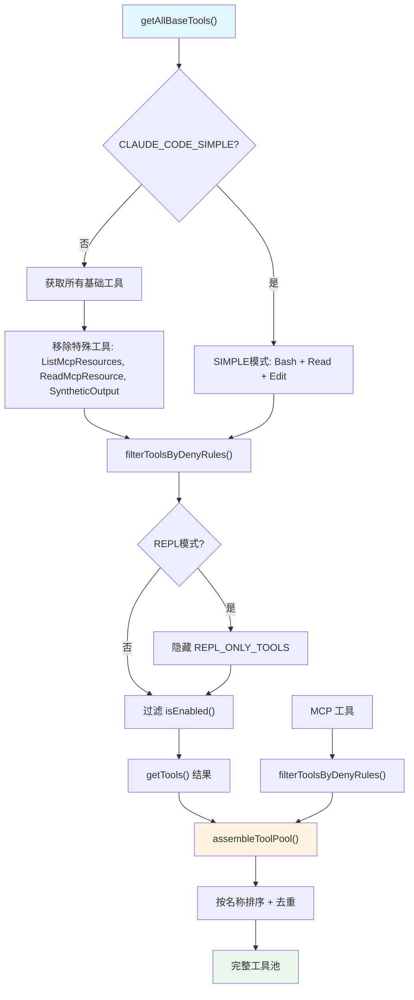
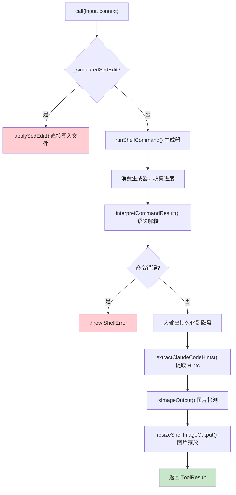
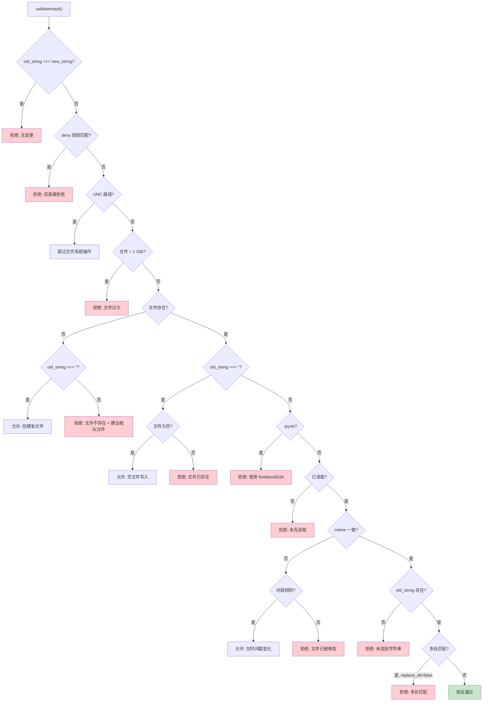
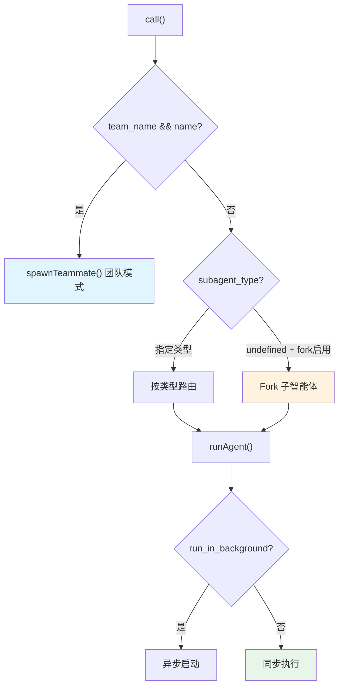
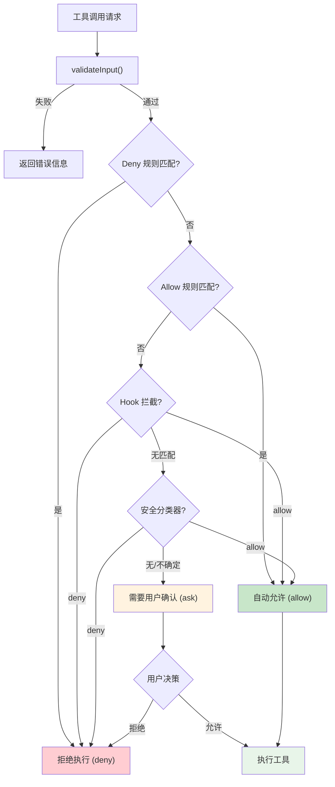
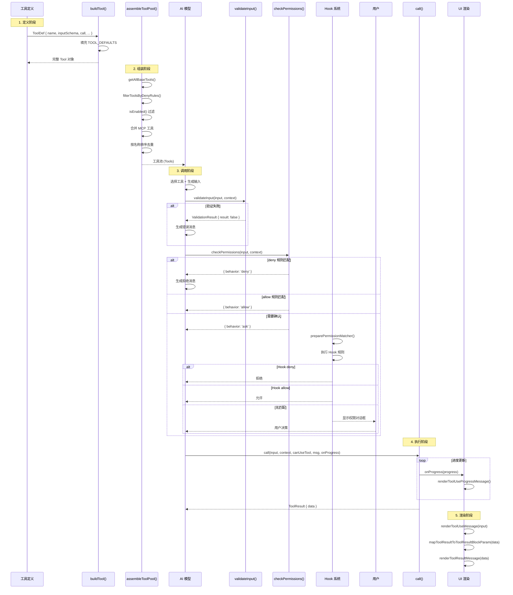
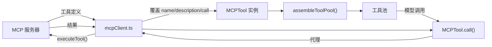

# Claude Code 源码深度分析 - 03 工具系统

## 1. 工具系统架构

Claude Code 的工具系统是其核心能力之一，为 AI 模型提供了与文件系统、Shell、网络、子智能体等交互的能力。整个工具系统围绕 `Tool` 接口构建，通过 `buildTool()` 工厂函数统一创建，由 `tools.ts` 负责组装和过滤，最终形成完整的工具池供模型使用。

### 1.1 Tool 接口 (src/Tool.ts, 792行)

`Tool` 是工具系统的核心类型定义，是一个泛型接口 `Tool<Input, Output, P>`，包含约 60 个字段和方法。它定义了工具的完整生命周期：从输入验证、权限检查、执行调用，到结果映射和 UI 渲染。

```mermaid
classDiagram
    class Tool~Input Output P~ {
        +string name
        +string[] aliases
        +searchHint?: string
        +inputSchema: ZodSchema~Input~
        +outputSchema?: ZodSchema
        +inputJSONSchema?: ToolInputJSONSchema
        +maxResultSizeChars: number
        +strict?: boolean
        +shouldDefer?: boolean
        +alwaysLoad?: boolean
        +isMcp?: boolean
        +isLsp?: boolean
        +mcpInfo?: {serverName, toolName}
        --
        +call(input, context, canUseTool, parentMessage, onProgress) ToolResult~Output~
        +description(input, options) string
        +prompt(options) string
        +validateInput?(input, context) ValidationResult
        +checkPermissions(input, context) PermissionResult
        +preparePermissionMatcher?(input) (pattern) => boolean
        +backfillObservableInput?(input) void
        --
        +isEnabled() boolean
        +isConcurrencySafe(input) boolean
        +isReadOnly(input) boolean
        +isDestructive?(input) boolean
        +interruptBehavior?() cancel | block
        +isOpenWorld?(input) boolean
        +requiresUserInteraction?() boolean
        +isSearchOrReadCommand?(input) {isSearch, isRead, isList?}
        +isTransparentWrapper?() boolean
        --
        +getPath?(input) string
        +userFacingName(input) string
        +userFacingNameBackgroundColor?(input) ThemeName
        +getToolUseSummary?(input) string | null
        +getActivityDescription?(input) string | null
        +toAutoClassifierInput(input) unknown
        +inputsEquivalent?(a, b) boolean
        --
        +mapToolResultToToolResultBlockParam(content, toolUseID) ToolResultBlockParam
        +renderToolUseMessage(input, options) ReactNode
        +renderToolResultMessage?(content, progress, options) ReactNode
        +renderToolUseProgressMessage?(progress, options) ReactNode
        +renderToolUseQueuedMessage?() ReactNode
        +renderToolUseRejectedMessage?(input, options) ReactNode
        +renderToolUseErrorMessage?(result, options) ReactNode
        +renderToolUseTag?(input) ReactNode
        +renderGroupedToolUse?(toolUses, options) ReactNode | null
        +extractSearchText?(output) string
        +isResultTruncated?(output) boolean
    }

    class ToolDef~Input Output P~ {
        <<partial>>
        所有 Tool 字段均为可选（DefaultableToolKeys）
    }

    class TOOL_DEFAULTS {
        isEnabled() true
        isConcurrencySafe(input) false
        isReadOnly(input) false
        isDestructive(input) false
        checkPermissions(input, ctx) allow
        toAutoClassifierInput(input) skip
        userFacingName(input) name
    }

    class ToolUseContext {
        +options: {commands, tools, mcpClients, ...}
        +abortController: AbortController
        +readFileState: FileStateCache
        +getAppState() AppState
        +setAppState(fn) void
        +messages: Message[]
        +fileReadingLimits?: {maxTokens, maxSizeBytes}
        +globLimits?: {maxResults}
        +toolDecisions?: Map
        +agentId?: AgentId
        +agentType?: string
        +contentReplacementState?: ContentReplacementState
    }

    class ToolResult~Output~ {
        +data: Output
        +newMessages?: Message[]
        +contextModifier?: (ctx) => ToolUseContext
        +mcpMeta?: {_meta, structuredContent}
    }

    ToolDef --> TOOL_DEFAULTS : 填充默认值
    ToolDef --> Tool : buildTool() 构建
    Tool --> ToolUseContext : 执行时接收
    Tool --> ToolResult : 执行时返回
```

**关键类型说明：**

| 类型 | 说明 |
|------|------|
| `Tools` | `readonly Tool[]`，工具集合的类型别名 |
| `ToolDef` | 部分定义类型，`DefaultableToolKeys` 中的方法可选 |
| `BuiltTool<D>` | 类型级展开，确保默认值填充后的完整类型 |
| `ToolUseContext` | 工具执行上下文，包含 AppState、AbortController、MCP 客户端等 |
| `ToolResult<T>` | 工具执行结果，包含 data、可选的 newMessages 和 contextModifier |
| `ToolPermissionContext` | 权限上下文，包含 mode、allow/deny/ask 规则等 |

### 1.2 buildTool() 构建函数

`buildTool()` (第 783-792 行) 是所有工具的统一构建入口。它接受一个 `ToolDef` 部分定义，通过展开运算符 `{...TOOL_DEFAULTS, ...def}` 填充安全默认值，返回完整的 `Tool` 对象。

```typescript
// 默认值策略（fail-closed 原则）：
const TOOL_DEFAULTS = {
  isEnabled: () => true,                    // 默认启用
  isConcurrencySafe: () => false,           // 默认不并发安全
  isReadOnly: () => false,                  // 默认非只读（假设有写操作）
  isDestructive: () => false,               // 默认非破坏性
  checkPermissions: (input, ctx) =>         // 默认允许，委托给通用权限系统
    Promise.resolve({ behavior: 'allow', updatedInput: input }),
  toAutoClassifierInput: () => '',           // 默认跳过安全分类器
  userFacingName: () => '',                  // 默认使用工具名
}
```

**DefaultableToolKeys** 包含 7 个可被默认值填充的方法：`isEnabled`、`isConcurrencySafe`、`isReadOnly`、`isDestructive`、`checkPermissions`、`toAutoClassifierInput`、`userFacingName`。

### 1.3 工具查找

```typescript
// 按名称或别名匹配工具
export function toolMatchesName(
  tool: { name: string; aliases?: string[] },
  name: string,
): boolean {
  return tool.name === name || (tool.aliases?.includes(name) ?? false)
}

// 从工具列表中按名称查找
export function findToolByName(tools: Tools, name: string): Tool | undefined {
  return tools.find(t => toolMatchesName(t, name))
}
```

### 1.4 工具组装流程 (src/tools.ts)

工具组装是一个多阶段流程，从所有基础工具定义开始，经过权限过滤、模式过滤、去重等步骤，最终形成完整的工具池。



**关键组装函数：**

| 函数 | 说明 |
|------|------|
| `getAllBaseTools()` | 返回所有可能的基础工具（约 40+ 个），受 feature flags 控制 |
| `getTools(permissionContext)` | 根据权限上下文过滤工具，处理 SIMPLE 模式和 REPL 模式 |
| `filterToolsByDenyRules(tools, ctx)` | 过滤被 blanket deny 的工具 |
| `assembleToolPool(ctx, mcpTools)` | 组装内置工具 + MCP 工具，按名称排序去重 |
| `getMergedTools(ctx, mcpTools)` | 简单合并内置工具和 MCP 工具（不去重） |

**SIMPLE 模式**（`CLAUDE_CODE_SIMPLE` 环境变量）下仅暴露三个核心工具：`BashTool`、`FileReadTool`、`FileEditTool`。如果同时启用了 REPL 模式，则用 `REPLTool` 替代。

**条件加载的工具**（通过 feature flags 或环境变量控制）：

| 工具 | 条件 |
|------|------|
| REPLTool | `USER_TYPE === 'ant'` |
| SuggestBackgroundPRTool | `USER_TYPE === 'ant'` |
| SleepTool | `PROACTIVE` 或 `KAIROS` feature |
| ScheduleCronTool 系列 | `AGENT_TRIGGERS` feature |
| RemoteTriggerTool | `AGENT_TRIGGERS_REMOTE` feature |
| MonitorTool | `MONITOR_TOOL` feature |
| WebBrowserTool | `WEB_BROWSER_TOOL` feature |
| WorkflowTool | `WORKFLOW_SCRIPTS` feature |
| VerifyPlanExecutionTool | `CLAUDE_CODE_VERIFY_PLAN === 'true'` |
| LSPTool | `ENABLE_LSP_TOOL` 环境变量 |
| EnterWorktreeTool/ExitWorktreeTool | worktree mode 启用 |
| TaskCreateTool/Get/Update/List | TodoV2 启用 |
| GlobTool/GrepTool | 非嵌入式搜索工具时（ant 构建有内置 bfs/ugrep） |
| ConfigTool/TungstenTool | `USER_TYPE === 'ant'` |

## 2. 核心工具详解

### 2.1 BashTool (Shell 命令执行)

**源码位置**: `src/tools/BashTool/BashTool.tsx` + 14 个辅助模块

BashTool 是最复杂的工具，负责执行 Shell 命令。它包含输入解析、安全验证、沙箱隔离、输出处理、进度报告等完整功能链。

**输入 Schema** (`fullInputSchema`):
```typescript
{
  command: string,                          // 要执行的命令
  timeout?: number,                         // 超时（毫秒），有最大值限制
  description?: string,                     // 命令描述
  run_in_background?: boolean,              // 后台运行
  dangerouslyDisableSandbox?: boolean,      // 危险：禁用沙箱
  _simulatedSedEdit?: {                     // 内部：预计算的 sed 编辑结果
    filePath: string,
    newContent: string
  }
}
```

> 注意：`_simulatedSedEdit` 从模型可见的 schema 中省略（通过 `.omit()`），防止模型绕过权限检查和沙箱。

**输出 Schema**:
```typescript
{
  stdout: string,                           // 标准输出
  stderr: string,                           // 标准错误（已合并到 stdout）
  interrupted: boolean,                     // 是否被中断
  isImage?: boolean,                        // 输出是否为图片
  backgroundTaskId?: string,                // 后台任务 ID
  backgroundedByUser?: boolean,             // 用户手动后台化
  assistantAutoBackgrounded?: boolean,      // 助手模式自动后台化
  dangerouslyDisableSandbox?: boolean,      // 沙箱是否被覆盖
  returnCodeInterpretation?: string,        // 退出码语义解释
  noOutputExpected?: boolean,               // 是否预期无输出
  structuredContent?: any[],                // 结构化内容块
  persistedOutputPath?: string,             // 持久化输出路径
  persistedOutputSize?: number              // 持久化输出大小
}
```

**核心执行流程**:



**关键特性**:

1. **命令分类**：通过 `isSearchOrReadBashCommand()` 将命令分类为搜索/读取/列表操作，用于 UI 折叠显示
2. **只读检测**：`checkReadOnlyConstraints()` 检测命令是否为只读（如 `ls`、`cat`、`git status`），只读命令自动允许并发
3. **sleep 阻塞检测**：`detectBlockedSleepPattern()` 检测 `sleep` 命令，阻止前台长时间阻塞
4. **沙箱隔离**：`shouldUseSandbox()` 判断是否需要沙箱，`SandboxManager` 注释沙箱违规
5. **Claude Code Hints 协议**：从 stderr 中提取 `<claude-code-hint />` 标签，零 token 侧通道
6. **大输出处理**：超过 `maxResultSizeChars`（30K）的输出持久化到 `tool-results/` 目录
7. **后台任务**：支持 `run_in_background`，超过 15 秒的阻塞命令在助手模式下自动后台化
8. **sed 编辑模拟**：`_simulatedSedEdit` 允许预览后的 sed 编辑直接写入文件

**辅助模块**:

| 文件 | 功能 |
|------|------|
| `bashSecurity.ts` | 安全检查（命令注入防护） |
| `commandSemantics.ts` | 命令结果语义解释 |
| `sedEditParser.ts` | sed 命令解析 |
| `sedValidation.ts` | sed 编辑验证 |
| `shouldUseSandbox.ts` | 沙箱决策 |
| `bashPermissions.ts` | 权限匹配（含复合命令拆分） |
| `modeValidation.ts` | 模式验证 |
| `readOnlyValidation.ts` | 只读约束检查 |
| `pathValidation.ts` | 路径验证 |
| `destructiveCommandWarning.ts` | 破坏性命令警告 |
| `bashCommandHelpers.ts` | 命令辅助函数 |
| `commentLabel.ts` | 注释标签 |
| `utils.ts` | 工具函数（图片处理等） |
| `toolName.ts` | 工具名常量 |

### 2.2 FileReadTool (文件读取)

**源码位置**: `src/tools/FileReadTool/FileReadTool.ts`

FileReadTool 支持多种文件格式的读取，包括文本文件、图片、PDF、Jupyter Notebook 等。

**输入 Schema**:
```typescript
{
  file_path: string,          // 文件绝对路径
  offset?: number,            // 起始行号
  limit?: number,             // 读取行数
  pages?: string,             // PDF 页码范围（如 "1-5", "3"）
}
```

**输出 Schema** (discriminated union):
```typescript
// 文本文件
{ type: 'text', file: { filePath, content, numLines, startLine, totalLines } }
// 图片文件
{ type: 'image', file: { base64, type, originalSize, dimensions? } }
// Jupyter Notebook
{ type: 'notebook', file: { filePath, cells } }
// PDF（完整）
{ type: 'pdf', file: { filePath, base64, originalSize } }
// PDF（分页提取）
{ type: 'parts', file: { filePath, originalSize, count, outputDir } }
// 文件未变化
{ type: 'file_unchanged', file: { filePath } }
```

**核心特性**:

1. **去重优化**：通过 `readFileState` 缓存追踪已读文件，相同内容返回 `file_unchanged`
2. **多格式支持**：文本、图片（PNG/JPG/JPEG/GIF/WEBP）、PDF、Jupyter Notebook
3. **图片处理**：`compressImageBufferWithTokenLimit()` 按照令牌限制压缩图片，`maybeResizeAndDownsampleImageBuffer()` 缩放大图
4. **PDF 分页**：`extractPDFPages()` 提取指定页面，`readPDF()` 读取完整 PDF
5. **Notebook 解析**：`readNotebook()` + `mapNotebookCellsToToolResult()` 解析 Notebook 单元格
6. **Token 限制**：`MaxFileReadTokenExceededError` 当文件超过最大 token 限制时抛出
7. **macOS 截图兼容**：处理 macOS 截图文件名中窄不换行空格（U+202F）与普通空格的差异
8. **持久化禁用**：`maxResultSizeChars: Infinity`，避免 Read -> 文件 -> Read 的循环

**安全防护**:

```typescript
// 阻止的设备文件路径
const BLOCKED_DEVICE_PATHS = new Set([
  '/dev/zero', '/dev/random', '/dev/urandom', '/dev/full',  // 无限输出
  '/dev/stdin', '/dev/tty', '/dev/console',                   // 阻塞输入
  '/dev/stdout', '/dev/stderr',                               // 无意义
  '/dev/fd/0', '/dev/fd/1', '/dev/fd/2',                     // fd 别名
])
```

### 2.3 FileEditTool (文件编辑)

**源码位置**: `src/tools/FileEditTool/FileEditTool.ts`

FileEditTool 实现了基于搜索-替换的文件编辑，具有严格的验证链和原子性保证。

**输入 Schema**:
```typescript
{
  file_path: string,       // 文件路径
  old_string: string,      // 要搜索的字符串
  new_string: string,      // 替换字符串
  replace_all?: boolean,   // 是否替换所有匹配
}
```

**输出 Schema**:
```typescript
{
  structuredPatch: Array<{  // diff 补丁
    oldStart, oldLines, newStart, newLines, content
  }>,
  filePath: string,
  originalFile: string,    // 编辑前内容
  gitDiff?: object,        // git diff
}
```

**验证链** (`validateInput`):



**原子性写操作** (`call`):

```
1. discoverSkillDirsForPaths() - 发现技能目录
2. diagnosticTracker.beforeFileEdited() - 诊断追踪
3. fs.mkdir(dirname) - 确保父目录存在
4. fileHistoryTrackEdit() - 文件历史备份
5. readFileForEdit() - 读取当前文件内容
6. mtime 一致性检查 - 确保文件未被外部修改
7. findActualString() - 引号归一化匹配
8. preserveQuoteStyle() - 保留引号风格
9. getPatchForEdit() - 生成 diff 补丁
10. writeTextContent() - 写入磁盘
11. LSP didChange + didSave 通知
12. VSCode 文件更新通知
```

### 2.4 FileWriteTool (文件写入)

**源码位置**: `src/tools/FileWriteTool/FileWriteTool.ts`

**输入 Schema**:
```typescript
{
  file_path: string,    // 文件绝对路径
  content: string,      // 要写入的内容
}
```

**输出 Schema**:
```typescript
{
  type: 'create' | 'update',       // 创建或更新
  filePath: string,
  content: string,
  structuredPatch: Array,           // diff 补丁
  originalFile: string | null,      // 原始内容（新文件为 null）
  gitDiff?: object,
}
```

**核心流程**:
1. 确保父目录存在 (`fs.mkdir`)
2. 文件历史备份 (`fileHistoryTrackEdit`)
3. 原子性写操作 (`writeTextContent`)
4. LSP 通知 (`didChange` + `didSave`)
5. VSCode 文件更新通知

### 2.5 AgentTool (子智能体)

**源码位置**: `src/tools/AgentTool/AgentTool.tsx` + 18 个辅助模块

AgentTool 是 Claude Code 多智能体架构的核心，支持子智能体、团队协作和 Fork 模式。

**输入 Schema**:
```typescript
{
  prompt: string,                    // 子智能体提示
  subagent_type?: string,            // 智能体类型
  description?: string,              // 描述
  model?: string,                    // 模型选择
  run_in_background?: boolean,       // 后台运行
  name?: string,                     // 队友名称（团队模式）
  team_name?: string,                // 团队名称
  mode?: 'plan',                     // 生成模式
  isolation?: string,                // 隔离模式
  cwd?: string,                      // 工作目录
}
```

**执行路由**:



**内置智能体类型**:

| 类型 | 文件 | 说明 |
|------|------|------|
| `general-purpose` | `built-in/generalPurposeAgent.ts` | 通用智能体 |
| `explore` | `built-in/exploreAgent.ts` | 探索智能体 |
| `plan` | `built-in/planAgent.ts` | 计划智能体 |
| `verification` | `built-in/verificationAgent.ts` | 验证智能体 |
| `claude-code-guide` | `built-in/claudeCodeGuideAgent.ts` | Claude Code 指南智能体 |
| Fork | `forkSubagent.ts` | Fork 子智能体（缓存共享） |

**关键约束**:
- 队友不能生成其他队友（团队名册是扁平的）
- 进程内队友不能生成后台智能体
- Fork 子智能体不能嵌套 Fork
- MCP 服务器依赖检查（等待 pending 服务器最多 30 秒）

### 2.6 WebSearchTool (网页搜索)

**源码位置**: `src/tools/WebSearchTool/WebSearchTool.ts`

**输入 Schema**:
```typescript
{
  query: string,                     // 搜索查询（最少 2 字符）
  allowed_domains?: string[],        // 允许的域名
  blocked_domains?: string[],        // 阻止的域名
}
```

**输出 Schema**:
```typescript
{
  query: string,
  results: Array<SearchResult | string>,  // 搜索结果或文本评论
  durationSeconds: number,
}
```

**核心实现**:
- 通过 Anthropic `web_search_20250305` 原生工具执行
- 支持最多 8 次搜索（`max_uses: 8`）
- 通过 `queryModelWithStreaming()` 流式处理搜索结果
- 实时进度报告（查询更新、结果接收）
- `shouldDefer: true`，需要 ToolSearch 先发现
- 仅对 `firstParty`、`vertex`（Claude 4.0+）和 `foundry` 提供商启用

### 2.7 WebFetchTool (URL 获取)

**源码位置**: `src/tools/WebFetchTool/WebFetchTool.ts`

**输入 Schema**:
```typescript
{
  url: string,     // 要获取的 URL
  prompt: string,  // 对获取内容应用的提示
}
```

**输出 Schema**:
```typescript
{
  bytes: number,        // 内容大小（字节）
  code: number,         // HTTP 状态码
  codeText: string,     // HTTP 状态文本
  result: string,       // 处理后的结果
  durationMs: number,   // 耗时（毫秒）
  url: string,          // 实际获取的 URL
}
```

**核心实现**:
- HTML 转 Markdown (`getURLMarkdownContent`)
- 应用提示处理内容 (`applyPromptToMarkdown`)
- 预批准主机检查 (`isPreapprovedHost`)
- `shouldDefer: true`

### 2.8 MCPTool (MCP 协议)

**源码位置**: `src/tools/MCPTool/MCPTool.ts`

**输入 Schema**: `z.object({}).passthrough()` -- 开放 schema，由 MCP 服务器定义

**输出 Schema**: `z.string()` -- 字符串结果

**核心实现**:
- 代理工具（proxy pattern），实际执行在 `mcpClient.ts` 中
- `isMcp: true` 标记
- `name`、`description`、`call` 等在 `mcpClient.ts` 中被覆盖
- `mcpInfo` 记录原始服务器名和工具名
- 权限返回 `passthrough`，委托给通用权限系统

### 2.9 GlobTool (文件匹配)

**源码位置**: `src/tools/GlobTool/GlobTool.ts`

**输入 Schema**:
```typescript
{
  pattern: string,     // glob 模式
  path?: string,       // 搜索目录（默认 cwd）
}
```

**输出 Schema**:
```typescript
{
  durationMs: number,       // 耗时
  numFiles: number,         // 文件数量
  filenames: string[],      // 匹配的文件路径
  truncated: boolean,       // 是否被截断（默认 100 个）
}
```

**特性**:
- 并发安全 (`isConcurrencySafe: true`)
- 只读 (`isReadOnly: true`)
- UNC 路径安全检查
- 默认 100 个结果限制

### 2.10 GrepTool (内容搜索)

**源码位置**: `src/tools/GrepTool/GrepTool.ts`

**输入 Schema**:
```typescript
{
  pattern: string,              // 正则表达式
  path?: string,                // 搜索路径
  glob?: string,                // 文件过滤（如 "*.js"）
  output_mode?: 'content' | 'files_with_matches' | 'count',
  '-B'?: number,                // 前文行数
  '-A'?: number,                // 后文行数
  '-C'?: number,                // 上下文行数
  '-n'?: boolean,               // 显示行号
  '-i'?: boolean,               // 忽略大小写
  type?: string,                // 文件类型（js, py, rust 等）
  head_limit?: number,          // 输出限制（默认 250）
  offset?: number,              // 跳过前 N 行
  multiline?: boolean,          // 多行模式
}
```

**输出 Schema**:
```typescript
{
  mode: string,           // 输出模式
  numFiles: number,       // 匹配文件数
  filenames: string[],    // 文件路径列表
  content?: string,       // 匹配内容（content 模式）
  numLines?: number,      // 匹配行数
  numMatches?: number,    // 匹配数
}
```

**核心实现**:
- ripgrep (`rg`) 封装
- 三种输出模式：`content`（显示匹配行）、`files_with_matches`（仅文件路径）、`count`（匹配计数）
- 自动排除 VCS 目录（`.git`, `.svn`, `.hg`, `.bzr`, `.jj`）
- 并发安全、只读

## 3. 辅助工具一览

### 3.1 文件操作类

| 工具 | 源码 | 功能 | 特殊特性 |
|------|------|------|----------|
| NotebookEditTool | `NotebookEditTool/` | Jupyter Notebook 编辑 | replace/insert/delete 操作, `shouldDefer` |
| PowerShellTool | `PowerShellTool/` | PowerShell 命令执行 | BashTool 的 Windows 版本 |
| GlobTool | `GlobTool/` | 文件名模式匹配 | 默认 100 结果限制 |
| GrepTool | `GrepTool/` | 文件内容正则搜索 | ripgrep 封装, 三种输出模式 |

### 3.2 智能体与任务类

| 工具 | 源码 | 功能 | 特殊特性 |
|------|------|------|----------|
| AgentTool | `AgentTool/` | 子智能体调度 | Fork/团队/后台模式 |
| TaskCreateTool | `TaskCreateTool/` | 任务创建 | TodoV2, Hook 集成 |
| TaskListTool | `TaskListTool/` | 任务列表 | 只读 |
| TaskGetTool | `TaskGetTool/` | 任务查询 | - |
| TaskUpdateTool | `TaskUpdateTool/` | 任务更新 | - |
| TaskStopTool | `TaskStopTool/` | 任务停止 | - |
| TaskOutputTool | `TaskOutputTool/` | 任务输出 | - |

### 3.3 团队协作类

| 工具 | 源码 | 功能 | 特殊特性 |
|------|------|------|----------|
| TeamCreateTool | `TeamCreateTool/` | 团队创建 | Swarm, 颜色分配 |
| TeamDeleteTool | `TeamDeleteTool/` | 团队删除 | Swarm |
| SendMessageTool | `SendMessageTool/` | 消息发送 | 队友通信, shutdown 支持 |

### 3.4 交互与 UI 类

| 工具 | 源码 | 功能 | 特殊特性 |
|------|------|------|----------|
| AskUserQuestionTool | `AskUserQuestionTool/` | 用户问答 | 2-4 选项, 多选, 预览 |
| BriefTool | `BriefTool/` | 简报生成 | 附件上传 |

### 3.5 开发辅助类

| 工具 | 源码 | 功能 | 特殊特性 |
|------|------|------|----------|
| LSPTool | `LSPTool/` | LSP 操作 | 9 种操作, 10MB 限制 |
| ConfigTool | `ConfigTool/` | 配置管理 | get/set |
| SkillTool | `SkillTool/` | 技能调用 | MCP 技能发现 |
| ToolSearchTool | `ToolSearchTool/` | 工具搜索 | 延迟加载工具发现 |
| REPLTool | `REPLTool/` | REPL 环境 | ant-only, 透明包装器 |

### 3.6 模式切换类

| 工具 | 源码 | 功能 | 特殊特性 |
|------|------|------|----------|
| EnterPlanModeTool | `EnterPlanModeTool/` | 进入计划模式 | 权限切换 |
| ExitPlanModeV2Tool | `ExitPlanModeTool/` | 退出计划模式 | - |
| EnterWorktreeTool | `EnterWorktreeTool/` | 进入 Worktree | git worktree |
| ExitWorktreeTool | `ExitWorktreeTool/` | 退出 Worktree | - |

### 3.7 MCP 相关类

| 工具 | 源码 | 功能 | 特殊特性 |
|------|------|------|----------|
| MCPTool | `MCPTool/` | MCP 协议代理 | 开放 schema |
| ListMcpResourcesTool | `ListMcpResourcesTool/` | MCP 资源列表 | - |
| ReadMcpResourceTool | `ReadMcpResourceTool/` | MCP 资源读取 | - |
| McpAuthTool | `McpAuthTool/` | MCP 认证 | - |

### 3.8 内部/条件加载类

| 工具 | 源码 | 功能 | 条件 |
|------|------|------|------|
| TodoWriteTool | `TodoWriteTool/` | 旧版 Todo 管理 | TodoV2 启用时禁用 |
| SleepTool | `SleepTool/` | 睡眠 | PROACTIVE/KAIROS |
| SuggestBackgroundPRTool | `SuggestBackgroundPRTool/` | PR 建议 | ant-only |
| TungstenTool | `TungstenTool/` | Tungsten | ant-only |
| VerifyPlanExecutionTool | `VerifyPlanExecutionTool/` | 计划验证 | CLAUDE_CODE_VERIFY_PLAN |
| SyntheticOutputTool | `SyntheticOutputTool/` | 合成输出 | 内部使用 |
| REPLTool | `REPLTool/` | REPL 环境 | ant-only |
| WorkflowTool | `WorkflowTool/` | 工作流 | WORKFLOW_SCRIPTS |
| RemoteTriggerTool | `RemoteTriggerTool/` | 远程触发 | AGENT_TRIGGERS_REMOTE |
| ScheduleCronTool 系列 | `ScheduleCronTool/` | 定时任务 | AGENT_TRIGGERS |
| MonitorTool | `MonitorTool/` | 监控 | MONITOR_TOOL |
| WebBrowserTool | `WebBrowserTool/` | 浏览器 | WEB_BROWSER_TOOL |
| SnipTool | `SnipTool/` | 历史裁剪 | HISTORY_SNIP |
| ListPeersTool | `ListPeersTool/` | 对等节点列表 | UDS_INBOX |
| CtxInspectTool | `CtxInspectTool/` | 上下文检查 | CONTEXT_COLLAPSE |
| TerminalCaptureTool | `TerminalCaptureTool/` | 终端捕获 | TERMINAL_PANEL |
| OverflowTestTool | `OverflowTestTool/` | 溢出测试 | OVERFLOW_TEST_TOOL |
| TestingPermissionTool | `testing/` | 测试权限 | NODE_ENV=test |

### 3.9 LSPTool 操作详情

LSPTool 通过 discriminated union schema 支持 9 种 LSP 操作：

| 操作 | 说明 |
|------|------|
| `goToDefinition` | 跳转到定义 |
| `findReferences` | 查找引用 |
| `hover` | 悬停信息（文档、类型） |
| `documentSymbol` | 文档符号（函数、类、变量） |
| `workspaceSymbol` | 工作区符号搜索 |
| `goToImplementation` | 跳转到实现 |
| `prepareCallHierarchy` | 准备调用层次 |
| `incomingCalls` | 查找调用者 |
| `outgoingCalls` | 查找被调用者 |

## 4. 权限系统

### 4.1 三层权限架构

Claude Code 的权限系统采用多层决策架构，从 deny 规则到 allow 规则到用户确认，逐层过滤。



### 4.2 PermissionResult 类型

权限检查返回 `PermissionResult`，是一个联合类型：

```typescript
type PermissionResult =
  | PermissionAllowDecision    // 允许
  | PermissionAskDecision      // 询问用户
  | PermissionDenyDecision     // 拒绝
  | { behavior: 'passthrough' }  // 透传（委托给上层）
```

**PermissionAllowDecision**:
```typescript
{
  behavior: 'allow',
  updatedInput?: Input,        // 可修改输入
  userModified?: boolean,      // 用户是否修改了输入
  decisionReason?: PermissionDecisionReason,
  toolUseID?: string,
  acceptFeedback?: string,
  contentBlocks?: ContentBlockParam[],
}
```

**PermissionAskDecision**:
```typescript
{
  behavior: 'ask',
  message: string,             // 询问消息
  updatedInput?: Input,
  decisionReason?: PermissionDecisionReason,
  suggestions?: PermissionUpdate[],  // 建议的权限规则
  blockedPath?: string,
  metadata?: PermissionMetadata,
  pendingClassifierCheck?: PendingClassifierCheck,  // 异步分类器检查
  contentBlocks?: ContentBlockParam[],
}
```

**PermissionDenyDecision**:
```typescript
{
  behavior: 'deny',
  message: string,
  decisionReason: PermissionDecisionReason,
  toolUseID?: string,
}
```

### 4.3 PermissionDecisionReason

权限决策原因是一个 discriminated union，记录为什么做出某个决策：

```typescript
type PermissionDecisionReason =
  | { type: 'rule', rule: PermissionRule }                    // 权限规则
  | { type: 'mode', mode: PermissionMode }                    // 权限模式
  | { type: 'subcommandResults', reasons: Map<string, PermissionResult> }  // 子命令结果
  | { type: 'permissionPromptTool', ... }                     // 权限提示工具
  | { type: 'hook', hookName: string, hookSource?: string, reason?: string }  // Hook
  | { type: 'asyncAgent', reason: string }                    // 异步智能体
  | { type: 'sandboxOverride', reason: 'excludedCommand' | 'dangerouslyDisableSandbox' }  // 沙箱覆盖
  | { type: 'classifier', classifier: string, reason: string } // 安全分类器
  | { type: 'workingDir', reason: string }                    // 工作目录
  | { type: 'safetyCheck', reason: string, classifierApprovable: boolean }  // 安全检查
  | { type: 'other', reason: string }                         // 其他
```

### 4.4 ToolPermissionContext

```typescript
type ToolPermissionContext = {
  mode: PermissionMode,                              // 'default' | 'plan' | 'bypassPermissions' | 'auto' | 'bubble'
  additionalWorkingDirectories: Map<string, AdditionalWorkingDirectory>,
  alwaysAllowRules: ToolPermissionRulesBySource,      // 按来源分组的 allow 规则
  alwaysDenyRules: ToolPermissionRulesBySource,       // 按来源分组的 deny 规则
  alwaysAskRules: ToolPermissionRulesBySource,        // 按来源分组的 ask 规则
  isBypassPermissionsModeAvailable: boolean,
  isAutoModeAvailable?: boolean,
  strippedDangerousRules?: ToolPermissionRulesBySource,
  shouldAvoidPermissionPrompts?: boolean,             // 后台智能体自动拒绝
  awaitAutomatedChecksBeforeDialog?: boolean,         // 协调器等待自动检查
  prePlanMode?: PermissionMode,                       // 计划模式前的权限模式
}
```

**权限规则来源** (`PermissionRuleSource`):
- `localSettings` - 本地设置
- `projectSettings` - 项目设置
- `globalSettings` - 全局设置
- `cliArg` - 命令行参数
- `command` - 命令
- `session` - 会话

### 4.5 权限检查流程

**工具级权限** (`checkPermissions`):
1. 工具的 `checkPermissions()` 方法返回 `PermissionResult`
2. 对于 BashTool，`bashToolHasPermission()` 拆分复合命令逐个匹配
3. 对于文件工具，`checkReadPermissionForTool()` / `checkWritePermissionForTool()` 检查路径权限

**Hook 系统** (`preparePermissionMatcher`):
1. `preparePermissionMatcher()` 为 hook `if` 条件准备匹配器
2. 对 BashTool，解析命令为子命令列表，返回一个闭包匹配每个子命令
3. 对文件工具，直接匹配文件路径

**路径展开** (`backfillObservableInput`):
1. 在观察者（SDK stream、transcript、hooks）看到输入之前调用
2. 将相对路径和 `~` 展开为绝对路径
3. 防止 hook allowlist 通过路径变换绕过

**Deny 规则过滤** (`filterToolsByDenyRules`):
1. 在工具池组装阶段过滤被 blanket deny 的工具
2. 支持 MCP 服务器前缀规则（如 `mcp__server` 过滤整个服务器的工具）
3. 使用与运行时权限检查相同的匹配器

## 5. 安全防护机制

Claude Code 在工具系统中实现了多层安全防护：

### 5.1 文件系统安全

| 机制 | 适用工具 | 说明 |
|------|----------|------|
| UNC 路径防护 | FileRead, FileEdit, FileWrite, Glob | 阻止 `\\` 和 `//` 路径，防止 NTLM 凭据泄露 |
| 设备文件阻止 | FileRead | 阻止 `/dev/zero`, `/dev/random`, `/dev/stdin` 等设备文件 |
| 二进制检测 | FileRead | 通过扩展名和内容检测二进制文件 |
| 文件大小限制 | FileEdit (1 GiB), FileRead (token 限制) | 防止 OOM |
| 路径展开 | FileRead, FileEdit, FileWrite | `~` 和相对路径展开为绝对路径 |

### 5.2 命令执行安全

| 机制 | 适用工具 | 说明 |
|------|----------|------|
| 沙箱隔离 | BashTool, PowerShellTool | `shouldUseSandbox()` 判断，`SandboxManager` 执行 |
| 只读命令检测 | BashTool | `checkReadOnlyConstraints()` 自动允许只读命令 |
| sleep 阻塞检测 | BashTool | `detectBlockedSleepPattern()` 阻止前台长时间 sleep |
| 复合命令拆分 | BashTool | `parseForSecurity()` 拆分 `&&`, `||`, `;`, `|` 连接的命令 |
| 命令语义解释 | BashTool | `interpretCommandResult()` 区分错误退出码和特殊含义 |
| 破坏性命令警告 | BashTool | `destructiveCommandWarning` 对危险命令发出警告 |

### 5.3 文件编辑安全

| 机制 | 适用工具 | 说明 |
|------|----------|------|
| 先读后写 | FileEditTool | `readFileState` 追踪已读文件，未读文件拒绝编辑 |
| mtime 一致性 | FileEditTool | 检查文件修改时间，防止覆盖外部修改 |
| 内容比较回退 | FileEditTool | Windows 上 mtime 不可靠时比较内容 |
| 引号归一化 | FileEditTool | `findActualString()` 处理引号差异 |
| 原子性操作 | FileEditTool, FileWriteTool | 读-改-写之间无 yield，防止并发修改 |
| 文件历史备份 | FileEditTool, FileWriteTool | `fileHistoryTrackEdit()` 编辑前备份 |

### 5.4 密钥与敏感信息

| 机制 | 适用工具 | 说明 |
|------|----------|------|
| 团队记忆密钥扫描 | FileEditTool, FileWriteTool | `checkTeamMemSecrets()` 检测密钥泄露 |
| Claude Code Hints | BashTool | 零 token 侧通道，不暴露给模型 |

### 5.5 工具结果安全

| 机制 | 适用工具 | 说明 |
|------|----------|------|
| 大输出持久化 | BashTool (30K), 多数工具 (100K) | 超过阈值的输出保存到磁盘 |
| 图片缩放 | BashTool, FileReadTool | 按令牌限制压缩图片 |
| 持久化大小限制 | BashTool | 最大 64 MB |

## 6. 工具生命周期

工具从定义到执行的完整生命周期如下：



### 6.1 生命周期阶段详解

**阶段 1: 定义**
- 每个工具通过 `buildTool()` 从 `ToolDef` 构建为完整 `Tool`
- 填充 7 个默认方法（isEnabled, isConcurrencySafe 等）
- 使用 `lazySchema()` 延迟初始化 Zod schema

**阶段 2: 组装**
- `getAllBaseTools()` 收集所有基础工具（受 feature flags 控制）
- `getTools()` 根据权限上下文过滤
- `assembleToolPool()` 合并内置工具和 MCP 工具
- 按名称排序保证 prompt cache 稳定性

**阶段 3: 调用**
- 模型生成 `tool_use` 消息
- `validateInput()` 验证输入合法性
- `checkPermissions()` 检查权限
- Hook 系统执行 PreToolUse hooks
- 用户确认（如需要）

**阶段 4: 执行**
- `call()` 方法执行实际操作
- 通过 `onProgress` 回调报告进度
- `contextModifier` 可修改执行上下文（仅非并发安全工具）
- `newMessages` 可附加新消息到对话

**阶段 5: 渲染**
- `renderToolUseMessage()` 渲染工具调用消息
- `mapToolResultToToolResultBlockParam()` 将结果映射为 API 格式
- `renderToolResultMessage()` 渲染工具结果
- `renderGroupedToolUse()` 批量渲染并行工具调用
- `isResultTruncated()` 判断结果是否被截断

### 6.2 工具搜索与延迟加载

当工具数量超过阈值时，Claude Code 启用 ToolSearch 机制：

- `shouldDefer: true` 的工具（如 WebSearchTool、WebFetchTool）在初始 prompt 中不发送完整 schema
- 模型通过 `ToolSearchTool` 按关键词搜索需要的工具
- `alwaysLoad: true` 的工具始终加载（不受延迟加载影响）
- `searchHint` 提供搜索关键词提示（3-10 个词）

## 7. 工具与外部系统的集成

### 7.1 MCP (Model Context Protocol) 集成



MCP 工具的特殊处理：
- 名称格式：`mcp__{serverName}__{toolName}` 或 unprefixed（SDK 模式）
- `mcpInfo` 保留原始服务器名和工具名
- `inputJSONSchema` 直接使用 JSON Schema（非 Zod）
- 权限通过 `passthrough` 委托给通用系统
- `_meta['anthropic/alwaysLoad']` 控制是否始终加载

### 7.2 LSP (Language Server Protocol) 集成

- 通过 `ENABLE_LSP_TOOL` 环境变量启用
- `getLspServerManager()` 获取 LSP 管理器
- 文件编辑后发送 `didChange` + `didSave` 通知
- `clearDeliveredDiagnosticsForFile()` 清除旧诊断信息
- 9 种 LSP 操作覆盖代码导航的完整需求

### 7.3 VSCode 集成

- `notifyVscodeFileUpdated()` 在文件修改后通知 VSCode
- 通过 MCP SDK 桥接 VSCode 扩展

## 8. 总结

Claude Code 的工具系统是一个精心设计的架构，具有以下核心特点：

1. **统一的工具接口**：`Tool` 泛型接口定义了约 60 个字段，覆盖工具的完整生命周期
2. **安全的默认值**：`buildTool()` 采用 fail-closed 原则，默认不并发安全、非只读
3. **多层权限控制**：deny -> allow -> hook -> classifier -> ask 五层决策链
4. **原子性操作**：文件编辑在读-改-写之间无 yield，防止并发修改
5. **渐进式功能加载**：通过 feature flags 和环境变量控制 20+ 个条件工具
6. **丰富的 UI 渲染**：每个工具自定义渲染逻辑，支持进度、分组、折叠等显示模式
7. **可扩展的 MCP 协议**：通过 MCP 工具代理模式无缝集成外部工具
8. **多智能体架构**：AgentTool 支持子智能体、团队协作和 Fork 模式
