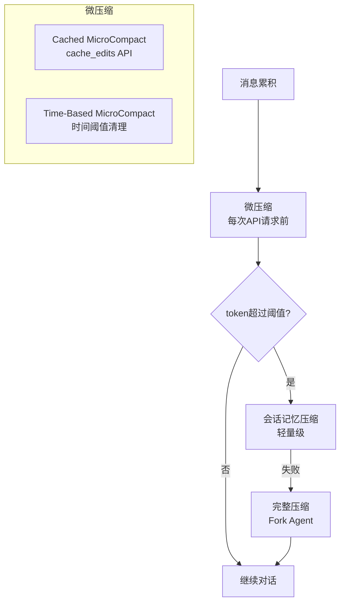

# Claude Code 源码深度分析 - 06 状态管理与服务层

## 1. 状态管理 (src/state/)

### 1.1 Store 实现 (store.ts, 34行)

基于 React `useSyncExternalStore` 的轻量级响应式状态管理方案，仅 34 行代码实现了完整的状态容器：

```typescript
// 核心接口
interface Store<T> {
  getState: () => T;
  setState: (partial: Partial<T> | ((prev: T) => Partial<T>)) => void;
  subscribe: (listener: (state: T) => void) => () => void;
}
```

**设计要点：**

- **getState()**：返回当前状态的快照，供外部同步读取
- **setState()**：支持直接传入部分状态对象或函数式更新，自动合并到现有状态
- **subscribe()**：注册状态变更监听器，返回取消订阅函数，与 `useSyncExternalStore` 无缝集成
- 无中间件、无 reducer、无 action 概念，极致精简

与 Redux 等重量级方案相比，这种设计避免了样板代码，同时借助 React 18 的并发特性保证了渲染一致性。

### 1.2 AppState (AppStateStore.ts)

`AppState` 是 Claude Code 的全局核心状态，定义了整个应用运行时所需的全部共享数据：

| 字段 | 类型 | 说明 |
|------|------|------|
| `settings` | `Settings` | 用户设置（模型选择、权限模式、自定义指令等） |
| `toolPermissionContext` | `ToolPermissionContext` | 工具权限上下文，控制各工具的允许/拒绝策略 |
| `tasks` | `Task[]` | 任务列表，追踪当前会话中的所有任务 |
| `viewingAgentTaskId` | `string \| null` | 当前查看的 Agent 任务 ID，用于多智能体场景 |
| `speculationState` | `'idle' \| 'active'` | 推测状态：idle 表示无推测，active 表示正在执行推测性请求 |
| `effortValue` | `Effort` | Effort 等级，控制模型推理深度（对应 Anthropic 的 thinking budget） |
| `fastMode` | `boolean` | 快速模式开关，启用后使用更轻量的模型和策略 |
| `remoteConnectionStatus` | `RemoteConnectionStatus` | 远程连接状态，用于 CCR (Claude Code Remote) 场景 |
| `isUltraplanMode` | `boolean` | Ultraplan 模式开关，启用深度规划能力 |
| `plugins` | `PluginState` | 插件状态，管理已加载的插件及其配置 |

**状态初始化流程：**

1. 从持久化存储（配置文件）加载 `settings`
2. 根据环境变量设置默认值（如 `CLAUDE_CODE_FAST_MODE`）
3. 初始化 `toolPermissionContext` 为默认权限策略
4. 注册全局状态监听器

### 1.3 AppState Provider (AppState.tsx)

`AppStateProvider` 是状态管理的 React 组件层，提供 Context 和 Hooks：

```typescript
// 核心 Hooks
function useAppState(): AppState;           // 读取状态
function useSetAppState(): SetState<AppState>; // 更新状态

// 副作用回调
function onChangeAppState(prev: AppState, next: AppState): void;
```

**onChangeAppState 副作用机制：**

当状态发生变更时，`onChangeAppState` 会执行一系列同步操作：

- **权限模式同步**：将 `toolPermissionContext` 的变更同步到 CCR (Claude Code Remote) 和 SDK 环境
- **设置持久化**：当 `settings` 变更时，自动写入配置文件
- **远程状态广播**：当 `remoteConnectionStatus` 变更时，通知远程连接管理器
- **插件状态更新**：当 `plugins` 变更时，触发插件生命周期钩子

这种设计将状态变更的副作用集中管理，避免了散落在各组件中的 `useEffect` 监听。

### 1.4 选择器 (selectors.ts)

选择器函数提供对 AppState 的派生数据访问，避免组件直接依赖状态结构：

```typescript
// 获取当前查看的队友任务
function getViewedTeammateTask(state: AppState): Task | undefined;

// 获取当前活跃的 Agent（用于确定输入应该发送给谁）
function getActiveAgentForInput(state: AppState): AgentInfo | null;
```

**设计原则：**

- 选择器是纯函数，输入相同则输出相同
- 支持记忆化（memoization），避免不必要的重计算
- 将状态结构的变更影响范围限制在选择器层

---

## 2. Compact 上下文压缩引擎 (src/services/compact/)

Claude Code 的上下文窗口管理是其核心竞争力之一。随着对话的进行，消息累积会逐渐耗尽上下文窗口。Compact 引擎通过多级压缩策略，在保留关键信息的前提下最大化利用有限的上下文空间。

### 2.1 三层压缩策略



**三层策略的设计哲学：**

| 层级 | 触发时机 | 成本 | 信息保留度 |
|------|----------|------|-----------|
| 微压缩 (MicroCompact) | 每次 API 请求前 | 零（复用缓存） | 高（仅删除冗余工具结果） |
| 会话记忆压缩 (SessionMemory) | token 超过阈值 | 低（轻量模型） | 中（结构化摘要） |
| 完整压缩 (Full Compact) | 会话记忆压缩失败 | 高（Fork Agent） | 中（深度摘要） |

### 2.2 微压缩 (MicroCompact)

微压缩是最轻量级的压缩手段，在每次 API 请求前自动执行，目标是删除不再需要的工具结果以释放上下文空间。

#### Cached MicroCompact

利用 Anthropic API 的 `cache_edits` 功能（即 Prompt Caching 的编辑模式）：

- **原理**：API 的 prompt caching 机制允许通过 `cache_control` 标记缓存前缀。Cached MicroCompact 通过发送 cache_edits 请求，删除已处理的工具结果，而不使缓存前缀失效
- **优势**：零额外 token 消耗，因为复用了已有的 prompt cache
- **适用场景**：工具结果体积较大且已不再需要（如已读取过的文件内容、已执行过的命令输出）
- **限制**：只能删除连续的消息块，不能删除散落在对话中间的消息

#### Time-Based MicroCompact

基于时间阈值的清理策略：

- **原理**：当工具结果的生成时间超过配置的阈值时，直接从消息历史中移除
- **阈值**：通常为几分钟，确保最近的工具结果保留，较早的结果被清理
- **适用场景**：长时间运行的任务中，早期的诊断输出、探索性命令结果等
- **优势**：实现简单，无需 API 调用

### 2.3 自动压缩 (AutoCompact)

当微压缩不足以控制上下文大小时，AutoCompact 机制会被触发。

**关键参数：**

```typescript
const AUTOCOMPACT_BUFFER_TOKENS = 13_000;  // 提前 13K token 触发压缩
const MAX_CONSECUTIVE_AUTOCOMPACT_FAILURES = 3;  // 连续失败熔断器
```

**执行流程：**

1. **阈值检测**：每次 API 请求前，估算当前消息历史的 token 数。如果总 token 数 + 预估的回复 token 数超过模型上下文窗口减去 `AUTOCOMPACT_BUFFER_TOKENS`，则触发压缩
2. **熔断器保护**：如果连续 3 次压缩失败（`MAX_CONSECUTIVE_AUTOCOMPACT_FAILURES`），则停止自动压缩，避免陷入压缩-失败-再压缩的死循环
3. **分级压缩**：先尝试轻量级的 `sessionMemoryCompact`，仅在失败时才回退到完整的 Fork Agent 压缩

**为什么是 13,000 token？**

这个缓冲值经过精心调优：它需要足够大以容纳压缩本身的 token 消耗（压缩提示词 + 压缩结果），同时足够小以最大化上下文利用率。13K 大约是一个中等长度工具调用的输出量。

### 2.4 完整压缩 (Full Compact)

当会话记忆压缩失败或不可用时，Claude Code 会执行完整压缩。这是最重量级但也最可靠的压缩方式。

**Fork Agent 机制：**

```
主对话 (Main Conversation)
    |
    +-- Fork Agent (压缩专用)
    |       |
    |       +-- 复用主对话的 prompt cache（系统提示词、工具定义等）
    |       +-- 接收完整消息历史
    |       +-- 生成结构化摘要
    |       +-- 返回摘要结果
    |
    +-- 用摘要替换原始消息历史
    +-- 清理缓存状态
    +-- 重新注入附件
```

**为什么使用 Fork Agent 而非直接压缩？**

- **缓存复用**：Fork Agent 可以复用主对话的 prompt cache，避免重复发送系统提示词和工具定义，节省大量 token
- **隔离性**：压缩过程在独立的 Agent 中执行，不影响主对话的状态
- **可靠性**：即使压缩过程出错，主对话也不会受损

**结构化摘要生成：**

压缩后的摘要采用 `<analysis>` + `<summary>` 的 XML 结构：

```xml
<analysis>
  <!-- 压缩分析过程，记录被保留和丢弃的信息 -->
</analysis>

<summary>
  <!-- 9个结构化部分 -->
  1. 主要请求 (Primary Request)
  2. 技术概念 (Technical Concepts)
  3. 文件和代码 (Files and Code)
  4. 错误修复 (Error Fixes)
  5. 问题解决 (Problem Resolution)
  6. 所有用户消息 (All User Messages)
  7. 待办任务 (Pending Tasks)
  8. 当前工作 (Current Work)
  9. 下一步 (Next Steps)
</summary>
```

**压缩后处理：**

1. **清理缓存状态**：重置 prompt cache 的引用，确保后续请求不会使用过期的缓存
2. **重新注入附件**：将用户上传的文件、图片等附件重新添加到消息历史中
3. **执行 Hooks**：触发 `pre-compact` 和 `post-compact` 钩子，允许插件和扩展参与压缩流程

### 2.5 压缩提示词设计

压缩提示词是 Compact 引擎的核心智力资产，它指导模型如何从大量对话中提取关键信息。9个摘要部分的设计遵循以下原则：

| 部分 | 目的 | 保留策略 |
|------|------|----------|
| 主要请求 | 记录用户的原始意图 | 始终保留，不可丢失 |
| 技术概念 | 记录讨论过的技术细节 | 保留关键概念，省略已解决的细节 |
| 文件和代码 | 记录涉及的关键文件和代码变更 | 保留文件路径和变更摘要，省略完整代码 |
| 错误修复 | 记录遇到和解决的错误 | 保留错误类型和解决方案，省略调试过程 |
| 问题解决 | 记录解决问题的关键步骤 | 保留决策点，省略探索过程 |
| 所有用户消息 | 完整保留用户输入 | 逐条保留，确保不遗漏用户意图 |
| 待办任务 | 记录未完成的任务 | 完整保留，确保任务连续性 |
| 当前工作 | 记录当前正在进行的操作 | 保留最新状态 |
| 下一步 | 记录接下来应该做什么 | 基于当前状态推断 |

---

## 3. Token 估算服务 (src/services/tokenEstimation.ts)

精确的 token 估算是上下文管理的基础。Claude Code 实现了四层递进的计数策略，在精度和性能之间取得平衡。

### 3.1 四层计数策略

```
优先级: 高 ────────────────────────────────────────────── 低
        │                                                │
        ▼                                                ▼
   精确计数 ──→ Haiku 回退 ──→ 粗略估算 ──→ Bedrock 适配
   (API)       (模型估算)     (字符比例)    (AWS 适配)
```

#### 第1层：精确计数 - countMessagesTokensWithAPI()

- **原理**：直接调用 Anthropic API 的 `countTokens` 端点
- **精度**：100% 准确，与实际 API 使用量一致
- **成本**：每次调用需要一次网络请求
- **适用场景**：需要精确 token 数的关键决策（如是否触发自动压缩）

#### 第2层：Haiku 回退 - countTokensViaHaikuFallback()

- **原理**：当 `countTokens` 端点不可用时，使用 Haiku 模型进行估算
- **精度**：约 95% 准确
- **成本**：消耗少量 Haiku token
- **适用场景**：API 端点暂时不可用或 Bedrock 环境

#### 第3层：粗略估算 - roughTokenCountEstimation()

- **原理**：基于字符数的简单估算
  - 普通文本：约 4 字符/token
  - JSON 内容：约 2 字符/token（因为 JSON 有大量标点和空格）
- **精度**：约 80-90% 准确
- **成本**：零，纯本地计算
- **适用场景**：快速预估算、网络不可用时的兜底方案

#### 第4层：Bedrock 适配 - countTokensWithBedrock()

- **原理**：使用 AWS Bedrock 的 `CountTokensCommand` API
- **精度**：100% 准确（Bedrock 环境）
- **适用场景**：通过 AWS Bedrock 使用 Claude 的环境

### 3.2 VCR 集成

所有 token 计数操作都通过 `withTokenCountVCR()` 包装，实现：

- **测试录制**：在测试环境中录制 token 计数的请求和响应
- **测试回放**：在 CI/CD 中回放录制的 token 计数结果，避免实际 API 调用
- **一致性保证**：确保测试环境和生产环境的 token 计数行为一致

---

## 4. MCP 服务 (src/services/mcp/)

MCP (Model Context Protocol) 是 Anthropic 推出的开放协议，允许 Claude Code 与外部工具和服务进行标准化交互。

### 4.1 核心功能

- **协议客户端**：实现 MCP 协议的客户端，与 MCP 服务器建立连接
- **OAuth 认证**：支持 OAuth 2.0 认证流程，安全地连接需要授权的 MCP 服务器
- **权限管理**：细粒度的工具权限控制，用户可以逐个工具授权或拒绝
- **工具发现与注册**：自动发现 MCP 服务器提供的工具，并注册到 Claude Code 的工具系统中

### 4.2 MCP 服务器生命周期

```
配置加载 → 连接建立 → 工具发现 → 权限协商 → 工具调用 → 断开连接
```

### 4.3 与工具系统的集成

MCP 工具被注册到 Claude Code 的工具系统中后，与内置工具（如 Read、Write、Bash）享有相同的调用接口。用户可以通过权限系统控制每个 MCP 工具的使用。

---

## 5. API 服务 (src/services/api/)

Claude Code 与 Anthropic API 的交互层，封装了所有 HTTP 通信细节。

### 5.1 核心功能

- **Anthropic API 客户端**：封装 Messages API、Streaming API 等
- **重试策略**：指数退避重试，处理速率限制（429）和服务不可用（529）错误
- **错误处理**：统一的错误分类和处理机制
- **用量追踪**：实时追踪 token 使用量，用于成本控制和上下文管理

### 5.2 重试策略

```
第1次重试: 等待 1秒
第2次重试: 等待 2秒
第3次重试: 等待 4秒
第4次重试: 等待 8秒
...最多重试 N 次
```

对于速率限制错误（429），从响应头中提取 `retry-after` 值作为等待时间。

### 5.3 流式处理

API 服务支持流式响应处理，通过 Server-Sent Events (SSE) 实时接收模型输出：

- **增量文本**：逐 token 接收文本内容
- **工具调用**：流式接收工具调用的参数
- **思考过程**：流式接收扩展思考（extended thinking）内容

---

## 6. 语音服务 (src/services/voice.ts)

Claude Code 支持语音输入功能，允许用户通过麦克风直接与 Claude 对话。

### 6.1 录音后端链

语音服务实现了三级录音后端回退机制，确保在不同平台上都能正常工作：

```
优先级: 高 ───────────────────────────────── 低
        │                                   │
        ▼                                   ▼
   Native Audio ──→ arecord (ALSA) ──→ SoX rec
   (cpal)         (Linux 专用)       (通用回退)
```

#### 第1级：Native Audio (cpal)

- **原理**：使用 `cpal` (Cross-Platform Audio Library) Rust 库的原生 Node.js 绑定
- **优势**：跨平台、低延迟、直接访问音频硬件
- **限制**：需要编译原生模块，在某些环境下可能安装失败

#### 第2级：arecord (ALSA)

- **原理**：调用 Linux ALSA 的 `arecord` 命令行工具
- **优势**：Linux 系统通常预装，无需额外依赖
- **限制**：仅限 Linux 平台

#### 第3级：SoX rec

- **原理**：调用 SoX (Sound eXchange) 的 `rec` 命令
- **优势**：最通用的回退方案，支持多种平台
- **限制**：需要用户安装 SoX

### 6.2 音频参数

- **采样率**：16kHz（语音识别的标准采样率）
- **声道**：单声道（语音输入不需要立体声）
- **位深度**：16-bit（CD 品质）

### 6.3 智能特性

- **静音检测**：2秒无声音自动停止录音，避免录制冗长的静音段
- **Push-to-talk 模式**：按住快捷键说话，松开自动发送，适合嘈杂环境
- **麦克风权限探测**：启动时自动检测麦克风权限，提供友好的权限请求引导

---

## 7. 通知服务 (src/services/notifier.ts)

通知服务负责在特定事件发生时向用户发送桌面通知。

### 7.1 多通道通知

通知服务支持多种通知通道，按优先级自动选择：

| 通道 | 说明 | 适用环境 |
|------|------|----------|
| `auto` | 自动检测最佳通道 | 所有环境 |
| `iterm2` | iTerm2 原生通知 | macOS + iTerm2 |
| `kitty` | Kitty 终端通知 | Kitty 终端 |
| `ghostty` | Ghostty 终端通知 | Ghostty 终端 |
| `terminal_bell` | 终端响铃 | 所有终端 |
| `notifications_disabled` | 禁用通知 | 用户选择 |

### 7.2 触发场景

- 长时间运行的命令完成时
- Agent 完成任务时
- 等待用户输入时（如权限确认）
- 错误发生时

---

## 8. VCR 测试系统 (src/services/vcr.ts)

VCR (Video Cassette Recorder) 测试系统是 Claude Code 测试基础设施的核心组件，用于录制和回放 API 交互。

### 8.1 核心功能

```typescript
// 录制/回放标准 API 对话
function withVCR(name: string, fn: () => Promise<void>): Promise<void>;

// 录制/回放流式 API 对话
function withStreamingVCR(name: string, fn: () => Promise<void>): Promise<void>;

// 录制/回放 token 计数
function withTokenCountVCR(name: string, fn: () => Promise<void>): Promise<void>;
```

### 8.2 工作模式

- **录制模式 (Recording)**：实际调用 API，将请求和响应保存到 YAML 文件
- **回放模式 (Playback)**：从 YAML 文件读取预录制的响应，不调用实际 API
- **自动检测**：根据环境变量自动选择模式

### 8.3 脱水/水合 (Dehydration/Hydration)

为确保录制的测试用例可移植和可版本控制，VCR 系统实现了数据脱敏：

| 替换类型 | 原始值 | 替换为 |
|----------|--------|--------|
| 文件路径 | `/home/user/project/src/index.ts` | `/mock/path/file.ts` |
| UUID | `550e8400-e29b-41d4-a716-446655440000` | `MOCK_UUID_1` |
| 时间戳 | `2024-01-15T10:30:00Z` | `MOCK_TIMESTAMP_1` |
| API Key | `sk-ant-...` | `MOCK_API_KEY` |

**脱水 (Dehydration)**：录制时将敏感和可变数据替换为占位符

**水合 (Hydration)**：回放时将占位符还原为测试所需的值

---

## 9. 其他服务子系统

Claude Code 的服务层远不止上述核心模块，还包含众多支撑子系统：

| 子系统 | 功能 | 关键特性 |
|--------|------|----------|
| **Analytics** | 数据分析与遥测 | DataDog 集成、GrowthBook A/B 测试框架 |
| **LSP** | Language Server Protocol | 代码补全、诊断、跳转定义 |
| **OAuth** | OAuth 认证流程 | 支持 MCP 和第三方服务的 OAuth 认证 |
| **SessionMemory** | 会话级记忆 | 在会话期间维护上下文记忆 |
| **AutoDream** | 自动记忆整合 | 后台自动整合对话中的关键信息到持久化记忆 |
| **ExtractMemories** | 对话记忆提取 | 从对话中提取值得长期保留的信息 |
| **PromptSuggestion** | 提示建议 | 基于上下文智能推荐下一步操作 |
| **AgentSummary** | Agent 摘要 | 为多智能体场景生成 Agent 工作摘要 |
| **MagicDocs** | 文档查询 | 智能检索项目文档和相关资料 |
| **Tools (编排)** | 工具执行与 Hook | 工具调用编排、前置/后置钩子 |
| **Plugins** | 插件管理 | 插件加载、生命周期管理 |
| **Tips** | 使用提示 | 上下文相关的使用技巧展示 |
| **TeamMemorySync** | 团队记忆同步 | 多用户间的记忆共享与同步 |
| **PolicyLimits** | 策略限制 | 组织级别的使用策略和限制 |
| **RemoteManagedSettings** | 远程托管设置 | 由组织管理员远程管理的配置 |
| **SettingsSync** | 设置同步 | 跨设备的设置同步 |
| **ContextCollapse** | 上下文折叠 | 智能折叠不活跃的上下文段 |

### 9.1 服务间的协作关系

```
                    ┌─────────────────────┐
                    │    AppState (状态)    │
                    └──────────┬──────────┘
                               │
              ┌────────────────┼────────────────┐
              │                │                │
    ┌─────────▼──────┐ ┌──────▼───────┐ ┌──────▼───────┐
    │  Compact 引擎   │ │  API 服务    │ │  MCP 服务    │
    │ (上下文管理)    │ │ (模型通信)   │ │ (工具扩展)   │
    └────────┬───────┘ └──────┬───────┘ └──────┬───────┘
             │                │                │
             └────────────────┼────────────────┘
                              │
                    ┌─────────▼──────────┐
                    │  Token 估算服务     │
                    │  (统一计数接口)     │
                    └────────────────────┘
```

这种分层架构使得每个服务可以独立演进，同时通过 AppState 和事件机制保持松耦合的协作关系。
