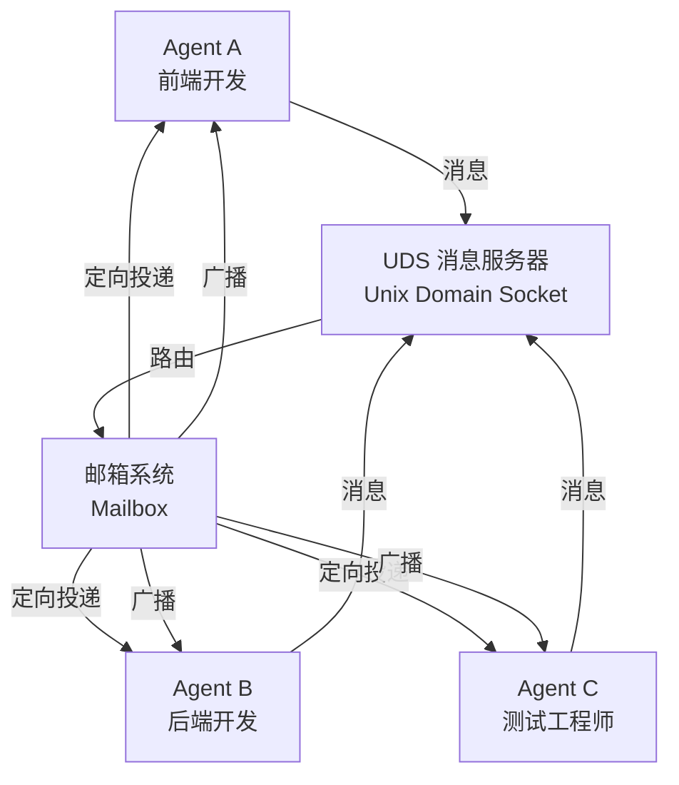
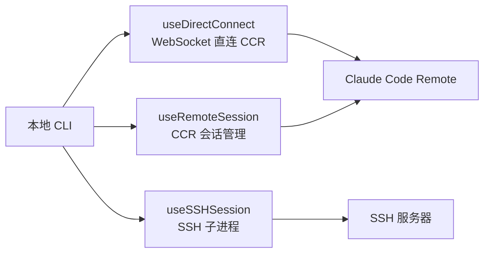
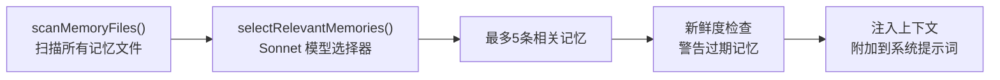

# Claude Code 源码深度分析 - 07 高级特性

## 1. 多智能体 Swarm 系统

### 1.1 概述

Agent Swarms 是 Claude Code 的多智能体协作系统，允许多个 Claude 实例同时工作，协同完成复杂任务。该系统通过 `TeamCreateTool`、`SendMessageTool` 和 `AgentTool` 三个核心工具实现，是 Claude Code 区别于传统 AI 编程助手的标志性特性。

**设计目标：**

- **并行执行**：多个 Agent 同时处理不同子任务，大幅提升效率
- **专业分工**：每个 Agent 可以专注于特定领域（前端、后端、测试等）
- **自主协作**：Agent 之间可以自主通信和协调，无需用户逐一指挥
- **资源隔离**：通过 Git worktree 或远程环境实现文件系统隔离

### 1.2 核心组件

#### TeamCreateTool

创建团队并初始化协作环境：

```typescript
interface TeamCreateTool {
  name: "team_create";
  description: "创建一个 Agent 团队来协作完成任务";
  parameters: {
    team_name: string;        // 团队名称
    teammates: TeammateConfig[];  // 队友配置
  };
}
```

**关键行为：**

- 为每个队友分配唯一的颜色标识（用于终端输出区分）
- 初始化邮箱系统（mailbox）用于消息路由
- 配置隔离策略（worktree 或 remote）
- 注册队友的技能和工具集

#### TeamDeleteTool

删除团队并清理资源：

- 终止所有队友 Agent 进程
- 清理 worktree 或远程会话
- 回收邮箱系统资源
- 汇总各队友的工作成果

#### SendMessageTool

队友间的通信桥梁：

```typescript
interface SendMessageTool {
  name: "send_message";
  parameters: {
    recipient: string;       // 接收者标识
    content: string;         // 消息内容
    message_type?: MessageType;  // 消息类型
  };
}
```

**支持的消息类型：**

| 类型 | 说明 |
|------|------|
| 普通消息 | 队友间的任务协调和信息共享 |
| `shutdown_request` | 请求队友终止工作 |
| `shutdown_response` | 队友对终止请求的响应 |
| `plan_approval_response` | 对计划的审批响应 |

#### AgentTool

生成和管理队友智能体：

- 根据 TeamCreateTool 的配置创建 Agent 实例
- 配置 Agent 的系统提示词、工具集和上下文
- 监控 Agent 的运行状态
- 处理 Agent 的异常退出和重启

#### useSwarmInitialization

React Hook，负责 Swarm 系统的初始化：

- 检测环境是否支持多智能体（内存、CPU、文件系统）
- 加载 Swarm 相关配置
- 初始化消息服务器
- 设置错误边界和超时处理

### 1.3 通信机制



**通信架构详解：**

- **UDS (Unix Domain Socket)**：底层消息传输通道，提供进程间通信能力。选择 UDS 而非 TCP 的原因是：同一机器上的 Agent 间通信无需网络栈开销，性能更优
- **邮箱系统 (Mailbox)**：消息路由层，为每个 Agent 维护一个消息队列。支持两种投递模式：
  - **定向消息**：发送给特定队友，用于任务分配和结果汇报
  - **广播消息**：发送给所有队友，用于状态同步和公告
- **结构化消息**：除纯文本消息外，还支持结构化消息类型（如 `shutdown_request`），用于系统级控制

### 1.4 隔离模式

为确保多个 Agent 不会互相干扰，Swarm 系统提供了两种隔离模式：

#### Worktree 隔离

```
主工作目录 (project/)
├── .git/
├── src/                    ← 主 Agent 工作目录
├── test/
└── .worktrees/
    ├── agent-frontend/     ← 前端 Agent 的独立工作树
    │   ├── .git (link)
    │   ├── src/
    │   └── test/
    └── agent-backend/      ← 后端 Agent 的独立工作树
        ├── .git (link)
        ├── src/
        └── test/
```

- **原理**：利用 Git worktree 功能为每个 Agent 创建独立的工作目录
- **优势**：文件系统完全隔离，Agent 之间不会产生文件冲突
- **限制**：需要 Git 仓库支持，同一分支不能被多个 worktree 同时使用

#### Remote 隔离

- **原理**：将队友 Agent 部署到远程 CCR (Claude Code Remote) 环境
- **优势**：可以利用远程机器的计算资源，突破本地资源限制
- **适用场景**：大规模并行任务、需要不同操作系统环境的任务

---

## 2. 远程会话系统 (src/remote/)

Claude Code 支持多种远程使用模式，允许用户在本地终端中操作远程开发环境。

### 2.1 RemoteSessionManager

远程会话管理器是远程系统的核心协调组件：

```typescript
class RemoteSessionManager {
  // WebSocket 订阅远程事件
  subscribe(sessionId: string): WebSocket;

  // HTTP POST 发送消息到远程
  postMessage(sessionId: string, message: Message): Promise<void>;

  // 权限请求/响应流
  requestPermission(permission: Permission): Promise<PermissionResponse>;
}
```

**超时策略：**

| 场景 | 超时时间 | 说明 |
|------|----------|------|
| 普通响应 | 60 秒 | 等待远程 Agent 的响应 |
| 压缩期间 | 3 分钟 | 压缩操作耗时较长，给予更多时间 |
| 权限请求 | 无超时 | 等待用户手动确认 |

### 2.2 SessionsWebSocket

WebSocket 连接管理器，维护与远程端的持久连接：

- **自动重连**：连接断开后自动重连，最多重试 5 次
- **心跳机制**：每 30 秒发送一次心跳包，检测连接活性
- **4001 重试**：当收到 4001 状态码时，执行特殊的重连逻辑（通常表示远程端需要重新认证）

### 2.3 三种远程模式



#### useDirectConnect

- **原理**：通过 WebSocket 直接连接到 CCR (Claude Code Remote) 服务
- **适用场景**：Claude.ai 网页端发起的远程会话
- **特点**：延迟最低，实时性最好

#### useRemoteSession

- **原理**：通过 CCR 的会话管理 API 创建和管理远程会话
- **适用场景**：需要会话持久化和恢复的场景
- **特点**：支持会话恢复，断线后可以继续之前的对话

#### useSSHSession

- **原理**：通过 SSH 协议连接到远程机器，在远程机器上启动 Claude Code 子进程
- **适用场景**：连接到自托管的远程开发环境
- **特点**：兼容性最好，只要有 SSH 访问权限即可使用

### 2.4 远程权限桥接 (remotePermissionBridge.ts)

当 Claude Code 运行在远程模式时，权限确认需要在本地和远程之间传递。`remotePermissionBridge` 解决了这个问题：

- **合成 AssistantMessage**：当远程 Agent 请求执行工具时，在本地创建一个合成的 `AssistantMessage`，展示工具调用详情
- **Tool Stub**：创建工具调用的存根对象，包含工具名称和参数，但不实际执行
- **权限回调**：用户在本地确认或拒绝权限后，将结果发送回远程 Agent

```
远程 Agent 请求执行 Bash("rm -rf /tmp/cache")
    ↓
remotePermissionBridge 创建合成消息
    ↓
本地 CLI 展示权限确认界面
    ↓
用户选择 "允许"
    ↓
权限结果发送回远程 Agent
    ↓
远程 Agent 执行 Bash 命令
```

---

## 3. IDE 桥接系统 (src/bridge/)

Bridge 系统是 Claude Code 的"双面人"架构——它允许 claude.ai 网页端作为前端界面，控制运行在本地或远程的 Claude Code CLI 引擎。

### 3.1 架构

```
┌─────────────────────────────────────────────────┐
│                  claude.ai 网页端                 │
│            (用户界面、消息展示、权限确认)           │
└──────────────────────┬──────────────────────────┘
                       │ HTTPS / WebSocket
                       ▼
┌─────────────────────────────────────────────────┐
│              Bridge 传输层                        │
│         (replBridgeTransport.ts)                 │
│         V1: 简单文本协议                          │
│         V2: 结构化 JSON 协议                      │
└──────────────────────┬──────────────────────────┘
                       │
                       ▼
┌─────────────────────────────────────────────────┐
│              Bridge 主循环                        │
│           (bridgeMain.ts)                        │
│    消息路由、会话管理、权限桥接                     │
└──────────────────────┬──────────────────────────┘
                       │
                       ▼
┌─────────────────────────────────────────────────┐
│           Claude Code CLI 引擎                    │
│     (完整的工具系统、Agent 循环、状态管理)          │
└─────────────────────────────────────────────────┘
```

### 3.2 核心组件

| 组件 | 文件 | 功能 |
|------|------|------|
| `bridgeApi.ts` | REST API 客户端 | 与 claude.ai 后端通信，创建和管理 Bridge 会话 |
| `bridgeMain.ts` | Bridge 主循环 | 消息分发、事件处理、会话生命周期管理 |
| `replBridge.ts` | REPL 消息流桥接 | 将 CLI 的 REPL 输入输出流桥接到 Bridge 协议 |
| `replBridgeTransport.ts` | 传输层 | 实现 V1 和 V2 两种传输协议 |
| `sessionRunner.ts` | 会话生成器 | 创建和管理 Claude Code 会话实例 |
| `bridgeMessaging.ts` | 消息路由 | 在网页端和 CLI 之间路由消息 |
| `bridgePermissionCallbacks.ts` | 权限回调 | 将 CLI 的权限请求转发到网页端，等待用户确认 |

### 3.3 传输协议

#### V1 协议（简单文本）

- 基于纯文本的消息传递
- 每条消息以换行符分隔
- 适用于简单的命令行交互场景

#### V2 协议（结构化 JSON）

- 基于 JSON 的结构化消息
- 支持消息类型标注、元数据附加
- 支持流式输出（增量文本、工具调用进度）
- 支持富文本渲染（代码高亮、文件差异展示）

### 3.4 SpawnMode

Bridge 支持三种会话生成模式：

| 模式 | 说明 | 适用场景 |
|------|------|----------|
| `single-session` | 单次会话，共享工作目录 | 简单任务 |
| `worktree` | 为每个会话创建 Git worktree | 需要文件隔离的并行任务 |
| `same-dir` | 多个会话共享同一目录 | 多人协作同一项目 |

---

## 4. 记忆系统 (src/memdir/)

Claude Code 的记忆系统是其"长期记忆"能力的实现，允许 Claude 在不同会话之间保留和检索关键信息。

### 4.1 架构

记忆系统基于文件系统实现，将记忆以 Markdown 文件的形式持久化存储：

```
~/.claude/
├── memories/
│   ├── private/           ← 私有记忆（仅当前用户可见）
│   │   ├── MEMORY.md      ← 私有记忆索引
│   │   ├── user.md        ← 用户角色和偏好
│   │   ├── feedback.md    ← 用户指导
│   │   └── ...
│   └── team/              ← 团队记忆（团队成员共享）
│       ├── MEMORY.md      ← 团队记忆索引
│       ├── project-alpha.md  ← 项目上下文
│       ├── reference-api.md  ← 参考资料
│       └── ...
```

### 4.2 四类记忆

| 类型 | 目录 | 默认可见性 | 说明 |
|------|------|-----------|------|
| `user` | private/ | 始终私有 | 用户角色、偏好、知识背景。Claude 用这些信息个性化交互风格 |
| `feedback` | private/ | 默认私有 | 用户对 Claude 行为的指导和纠正。如"我更喜欢函数式编程风格" |
| `project` | team/ | 偏向团队 | 项目上下文信息。如项目架构、技术栈、编码规范 |
| `reference` | team/ | 偏向团队 | 参考资料和知识库。如 API 文档摘要、设计决策记录 |

### 4.3 MEMORY.md 索引

每个记忆目录（private/ 和 team/）都有一个 `MEMORY.md` 文件作为入口索引：

**格式规范：**

```markdown
# Memory Index

- [用户偏好](user.md) -- 用户喜欢 TypeScript 和函数式编程
- [项目架构](project-alpha.md) -- Alpha 项目采用微服务架构
- [API 参考](reference-api.md) -- 内部 API 端点文档
```

**限制：**

- 最大 200 行
- 最大 25KB
- 每条索引项格式：`- [Title](file.md) -- one-line hook`

这些限制确保索引文件本身不会占用过多上下文空间，同时 `one-line hook` 提供了足够的信息供 Claude 判断是否需要加载完整记忆。

### 4.4 检索流程



**检索步骤详解：**

1. **scanMemoryFiles()**：扫描 private/ 和 team/ 目录下的所有 .md 文件，读取 MEMORY.md 索引和完整记忆文件
2. **selectRelevantMemories()**：使用 Sonnet 模型作为选择器，根据当前对话上下文从所有记忆中选择最相关的条目。选择器模型（而非主对话模型）的使用是为了节省成本
3. **Top-5 截断**：最多选择 5 条记忆，避免记忆注入占用过多上下文
4. **新鲜度警告**：检查选中记忆的创建/更新时间，如果超过一定时间（如 30 天），在注入时附加"此记忆可能已过期"的警告
5. **上下文注入**：将选中的记忆内容附加到系统提示词中，供主对话模型参考

---

## 5. 技能系统 (src/skills/)

技能系统是 Claude Code 的可扩展命令框架，允许用户通过自然语言或斜杠命令触发预定义的行为模式。

### 5.1 架构

```
用户输入 "/debug 为什么这个测试失败了"
    ↓
技能路由器 (SkillRouter)
    ↓
匹配到 "debug" 技能
    ↓
加载技能定义 (BundledSkillDefinition)
    ↓
注入技能上下文 (context + files + getPromptForCommand)
    ↓
Claude 按照技能提示词执行
```

### 5.2 内置技能 (16个)

| 技能 | 说明 |
|------|------|
| `batch` | 批量处理多个文件或任务 |
| `claudeApi` | 调用 Claude API 进行特定操作 |
| `claudeApiContent` | 使用 Claude API 处理内容 |
| `claudeInChrome` | 在 Chrome 浏览器中操作 Claude |
| `debug` | 调试模式，深入分析问题根因 |
| `keybindings` | 显示和配置快捷键 |
| `loop` | 循环执行任务直到满足条件 |
| `remember` | 将当前上下文保存到记忆系统 |
| `scheduleRemoteAgents` | 调度远程 Agent 执行任务 |
| `simplify` | 简化代码或解释 |
| `skillify` | 将当前对话模式保存为新技能 |
| `stuck` | 当 Claude 卡住时的自救策略 |
| `updateConfig` | 更新 Claude Code 配置 |
| `verify` | 验证代码正确性 |
| `loremIpsum` | 生成占位文本 |

### 5.3 BundledSkillDefinition 接口

每个技能通过 `BundledSkillDefinition` 接口定义：

```typescript
interface BundledSkillDefinition {
  name: string;              // 技能名称（唯一标识）
  description: string;       // 技能描述（用于自动匹配）
  aliases: string[];         // 别名列表
  whenToUse: string;         // 使用场景描述（供 Claude 判断何时使用）
  argumentHint: string;      // 参数提示（展示给用户的帮助信息）
  allowedTools: string[];    // 该技能允许使用的工具列表（限制工具集）
  model?: string;            // 指定使用的模型（可选，默认使用当前模型）
  context: string;           // 技能的上下文信息
  files: string[];           // 技能相关的文件列表
  getPromptForCommand: (args: string) => string;  // 根据参数生成提示词
}
```

**关键设计：**

- **allowedTools**：每个技能可以限制可用工具集。例如 `verify` 技能可能只允许使用 Read 和 Bash（运行测试），不允许 Write
- **model**：某些技能可能需要特定模型。例如 `debug` 技能可能指定使用更强的模型以获得更深入的分析
- **getPromptForCommand**：动态生成提示词，根据用户输入的参数定制技能行为

---

## 6. 插件系统 (src/plugins/)

插件系统是 Claude Code 的扩展机制，允许第三方和社区贡献功能扩展。

### 6.1 双层插件系统

```
┌─────────────────────────────────────────┐
│           插件系统                        │
├──────────────────┬──────────────────────┤
│  builtinPlugins  │     marketplace      │
│  (内置插件)       │    (市场插件)         │
│                  │                      │
│  - 用户可启用    │  - 从市场安装          │
│  - 用户可禁用    │  - 独立版本管理        │
│  - 随 CLI 分发   │  - 社区贡献           │
└──────────────────┴──────────────────────┘
```

#### builtinPlugins（内置插件）

- 随 Claude Code CLI 一起分发
- 用户可以通过 `/plugin` 命令启用或禁用
- 默认可能处于禁用状态，需要用户主动开启
- 示例：高级 Git 集成、特定框架支持等

#### marketplace（市场插件）

- 从插件市场安装
- 独立的版本管理，可以单独更新
- 社区贡献，经过审核后上架
- 支持插件评分和评论

### 6.2 插件组件

一个插件可以提供以下三种组件：

| 组件 | 说明 |
|------|------|
| **Skills** | 自定义技能，扩展 Claude Code 的命令系统 |
| **Hooks** | 生命周期钩子，在特定事件发生时执行自定义逻辑 |
| **MCP Servers** | MCP 服务器配置，为 Claude Code 添加外部工具 |

**插件示例结构：**

```json
{
  "name": "react-expert",
  "version": "1.0.0",
  "skills": [
    {
      "name": "react-component",
      "description": "创建 React 组件"
    }
  ],
  "hooks": {
    "pre-tool-execution": "validate-react-patterns.js"
  },
  "mcpServers": {
    "react-docs": {
      "command": "npx",
      "args": ["react-docs-mcp-server"]
    }
  }
}
```

### 6.3 与 Skills 的区别

| 维度 | Bundled Skills | 插件 |
|------|---------------|------|
| 来源 | 随 CLI 内置 | 内置或市场安装 |
| 可见性 | 直接可用 | 出现在 `/plugin` UI 中 |
| 可切换性 | 不可切换（始终可用） | 可启用/禁用 |
| 扩展能力 | 仅提供 skill | 可提供 skill + hook + MCP |
| 管理方式 | 代码内置 | 配置文件管理 |

---

## 7. Buddy 伙伴系统 (src/buddy/)

Buddy 是 Claude Code 的彩蛋功能——一个住在终端里的虚拟宠物伙伴。

### 7.1 物种与稀有度

**17种物种：**

duck, cat, dragon, dog, fish, frog, rabbit, turtle, bird, bear, fox, owl, panda, penguin, unicorn, phoenix, whale

**5种稀有度：**

| 稀有度 | 说明 | 出现概率 |
|--------|------|----------|
| Common | 常见 | 最高 |
| Uncommon | 不常见 | 较高 |
| Rare | 稀有 | 中等 |
| Epic | 史诗 | 较低 |
| Legendary | 传说 | 最低 |

### 7.2 生成机制

- **种子随机**：基于用户 ID（哈希值）作为随机种子，确保同一用户每次看到的 Buddy 相同
- **ASCII 精灵图**：每个物种有 3 帧动画帧，通过定时切换实现简单动画效果
- **终端渲染**：直接在终端中渲染 ASCII 艺术，不影响正常使用

### 7.3 设计哲学

Buddy 体现了 Claude Code 的设计理念——即使是开发者工具，也可以有趣和有人情味。这个功能不会影响任何核心功能，但为日常使用增添了一丝乐趣。

---

## 8. Coordinator 协调器模式

Coordinator 是 Claude Code 的一种特殊运行模式，通过环境变量 `CLAUDE_CODE_COORDINATOR_MODE` 启用。

### 8.1 设计目标

Coordinator 模式旨在让 Claude Code 作为"协调者"而非"执行者"运行。在这种模式下，Claude Code 不直接执行工具操作，而是：

- 分析任务并制定计划
- 将子任务分配给其他 Agent
- 监控执行进度
- 汇总结果并报告

### 8.2 核心特性

#### 限制可用工具集

在 Coordinator 模式下，Claude Code 的工具集被精简为协调所需的工具：

```
标准模式工具集:                    Coordinator 模式工具集:
├── Read                          ├── Read (只读)
├── Write                         ├── SendMessageTool
├── Bash                          ├── TeamCreateTool
├── Glob                          ├── TeamDeleteTool
├── Grep                          └── AgentTool
├── ...
└── (所有工具)

移除: Write, Bash, Glob, Grep 等直接操作工具
新增/保留: 消息和团队管理工具
```

这种限制确保 Coordinator 不会直接修改文件系统，而是通过消息和团队管理工具来协调其他 Agent。

#### 专门的上下文生成

Coordinator 模式提供专门的系统提示词上下文：

- 强调任务分解和计划制定
- 提供团队管理指导
- 包含进度监控和报告模板
- 定义与其他 Agent 的通信协议

#### 会话恢复时的模式匹配

当 Claude Code 从中断的会话恢复时，Coordinator 模式能够：

- 检测之前的运行模式
- 恢复团队状态和 Agent 配置
- 重新建立与队友 Agent 的通信
- 继续未完成的协调任务

### 8.3 使用场景

Coordinator 模式特别适合以下场景：

- **大型重构**：需要同时修改多个模块，Coordinator 可以将工作分配给专注于不同模块的 Agent
- **多项目任务**：需要跨多个代码库操作，每个 Agent 负责一个项目
- **CI/CD 管道**：Coordinator 可以协调测试、构建、部署等多个阶段
- **代码审查**：Coordinator 可以分配不同 Agent 审查不同文件的代码质量

### 8.4 与 Swarm 系统的关系

```
                    ┌─────────────────────┐
                    │  Coordinator 模式    │
                    │  (协调者 Claude)     │
                    └──────────┬──────────┘
                               │
                    ┌──────────▼──────────┐
                    │   Swarm 系统         │
                    │  (多智能体管理)       │
                    └──────────┬──────────┘
                               │
              ┌────────────────┼────────────────┐
              │                │                │
    ┌─────────▼──────┐ ┌──────▼───────┐ ┌──────▼───────┐
    │  Agent A        │ │  Agent B     │ │  Agent C     │
    │  (执行者模式)   │ │  (执行者模式) │ │  (执行者模式) │
    │  完整工具集      │ │  完整工具集    │ │  完整工具集    │
    └────────────────┘ └──────────────┘ └──────────────┘
```

Coordinator 模式是 Swarm 系统的"大脑"，而 Swarm 中的普通 Agent 是"手脚"。这种分层架构实现了高效的多智能体协作：Coordinator 负责思考和规划，普通 Agent 负责执行和操作。
