# Claude Code 源码深度分析 - 09 架构图集

> 本文档是 Claude Code 架构的集中图表参考，涵盖系统各层面的 Mermaid 架构图。每个图表配有标题与说明，便于快速理解整体设计。

---

## 1. 系统总体架构图

展示 Claude Code 的分层架构，从 CLI 入口到基础设施层。系统采用清晰的分层设计：入口层负责命令行解析，初始化层完成环境检查与会话准备，UI 层基于 Ink 终端渲染引擎构建，交互层通过 React Hooks 连接 UI 与业务逻辑，引擎层驱动核心查询循环，工具层与命令层提供丰富的能力扩展，服务层封装外部依赖，基础设施层提供状态管理与全局常量。

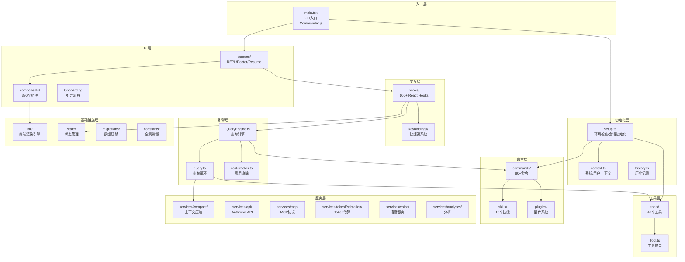

---

## 2. 应用启动时序图

展示从命令行输入到 REPL 就绪的完整启动流程。启动过程分为三个阶段：CLI 参数解析与并行预取、setup 初始化（包含环境检查、UDS 消息服务器、终端恢复、Hooks 配置等）、以及设置屏幕（Onboarding、信任对话框、MCP 审批等）。最终创建 QueryEngine 并进入 REPL 主循环。

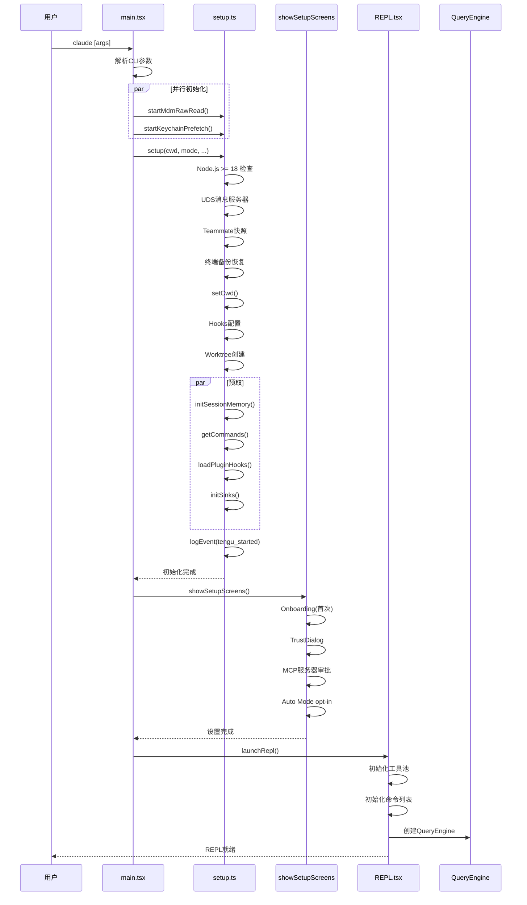

---

## 3. 查询循环流程图

展示 query.ts 中核心查询循环的完整流程。每次迭代从技能发现预取开始，经过消息获取、工具结果预算、snip 压缩、微压缩等步骤后调用 Claude API。若响应包含工具调用则执行工具并检查是否需要自动压缩，然后根据 token 预算和最大轮次决定是否继续迭代。

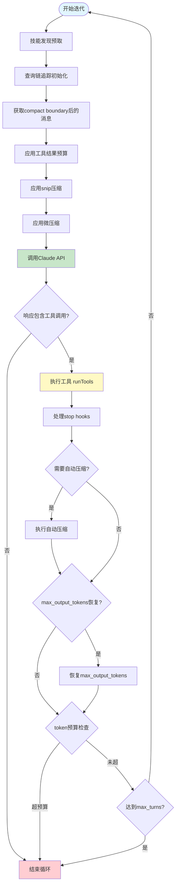

---

## 4. 工具生命周期时序图

展示工具从定义到执行的完整生命周期。QueryEngine 发起工具调用后，runTools 负责查找工具、验证输入、检查权限。若需要用户确认则弹出对话框。权限通过后渲染工具使用消息，调用工具实现，支持进度报告回调，最终返回工具结果并渲染到 UI。

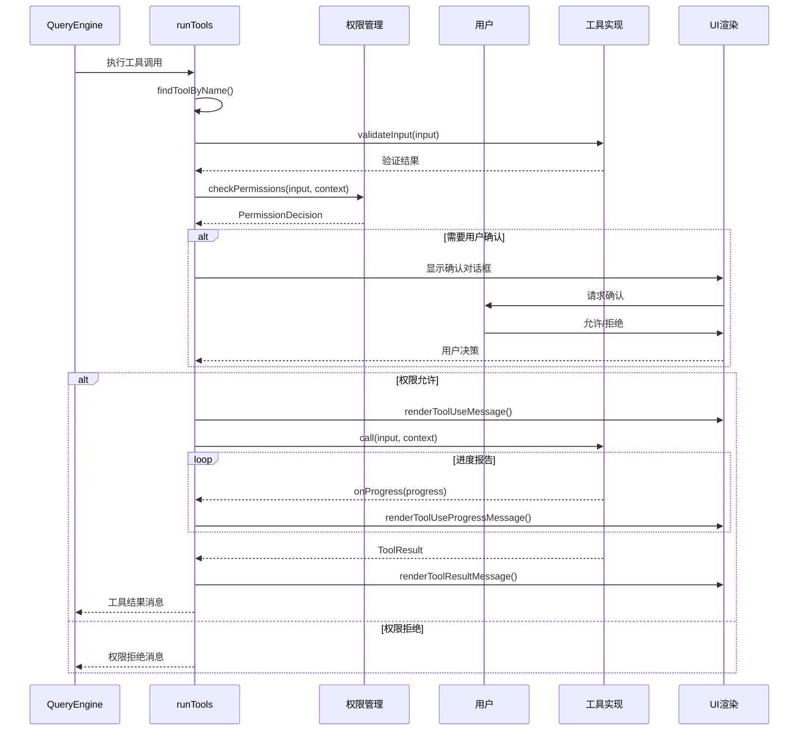

---

## 5. 上下文压缩策略图

展示三层压缩策略的工作流程。微压缩（MicroCompact）在每次 API 请求前执行，包含缓存编辑清理和时间阈值清理。自动压缩（AutoCompact）在 token 超过阈值时触发，优先尝试 sessionMemoryCompact，失败则进入完整压缩流程：Fork Agent 生成结构化摘要（9个部分），清理缓存状态，重新注入附件。

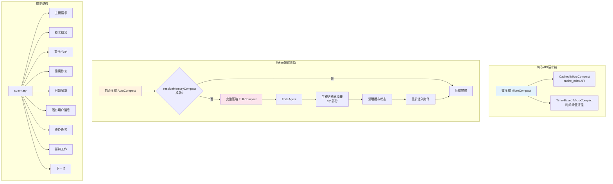

---

## 6. 消息处理管线图

展示消息从 API 响应到终端渲染的处理管线。消息经过标准化、UI 排序、分组后，依次折叠背景 Bash 通知、Hook 摘要、Teammate 关闭、Read/Search 分组等次要消息。若消息数超过 200 条则启用虚拟滚动，最终由 Message.tsx 根据消息类型路由到对应的渲染组件。

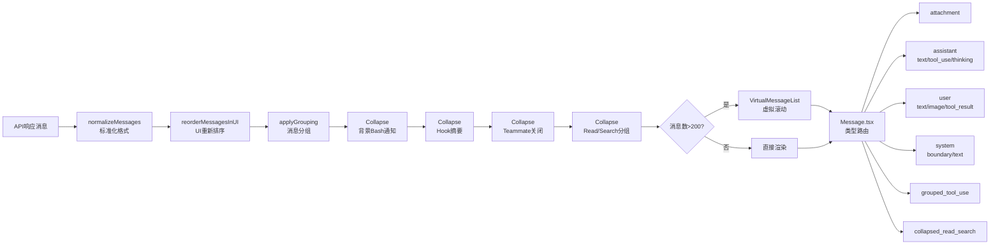

---

## 7. 权限系统流程图

展示三层权限架构的决策流程。工具调用请求首先经过 Deny 规则匹配（黑名单），再经过 Allow 规则匹配（白名单）。若均未命中，则检查工具是否为只读操作。只读工具自动允许，其他工具弹出确认对话框。用户可选择"始终允许"（保存规则）、"允许一次"或"拒绝"。

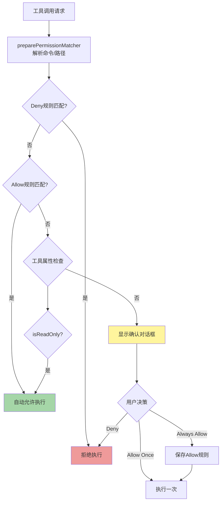

---

## 8. 多智能体 Swarm 通信图

展示 Swarm 系统的通信架构。主 Agent 通过 TeamCreateTool 创建队友，每个队友拥有独立的 QueryEngine 和工具集。通信基于 UDS 消息服务器和邮箱机制：主 Agent 写入队友邮箱，队友通过 UDS 发送消息，消息经 UDS 投递到目标邮箱。各队友通过 git worktree 实现工作目录隔离。

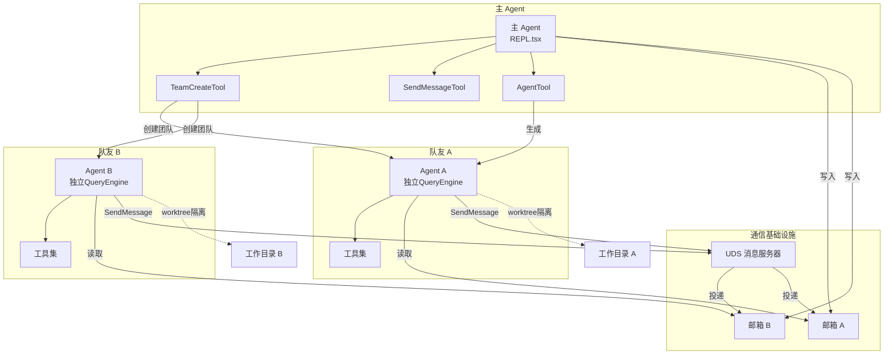

---

## 9. 远程会话架构图

展示三种远程模式的架构。Direct Connect 模式通过 WebSocket 直连 Claude Cloud Runtime；Remote Session 模式通过 RemoteSessionManager 管理 WebSocket 订阅和 HTTP POST 发送，并包含远程权限桥接；SSH 模式通过 SSHSessionManager 启动 SSH 子进程连接远程机器。

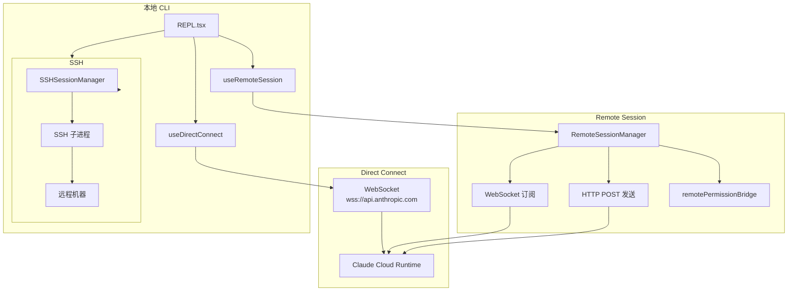

---

## 10. 记忆系统架构图

展示 memdir 记忆系统的架构。记忆分为私有记忆（`~/.claude/memory/`，包含用户偏好和用户指导）和团队记忆（项目 `.claude/memory/`，包含项目上下文和参考资料）。检索时先扫描目录，再由 Sonnet 选择器选取最多 5 条相关记忆，附带新鲜度警告后注入上下文。每个子目录通过 MEMORY.md 索引文件组织。

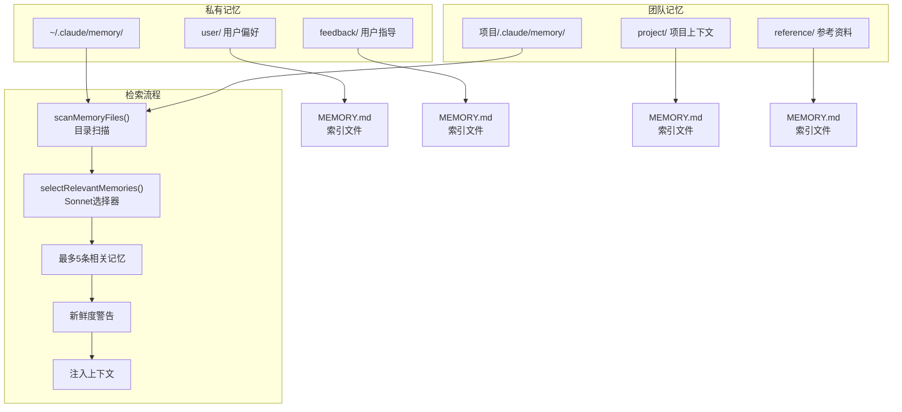

---

## 11. IDE 桥接架构图

展示 Bridge 系统的架构。用户在 claude.ai 网页创建 Work，Claude API 通过轮询机制将 Work 投递到本地 CLI Bridge。bridgeMain.ts 作为主循环，bridgeApi.ts 负责与 Claude API 通信，sessionRunner.ts 支持三种会话模式（single-session、worktree、same-dir），生成的 REPL 通过 replBridge.ts 和传输层将结果回传到 claude.ai 网页。

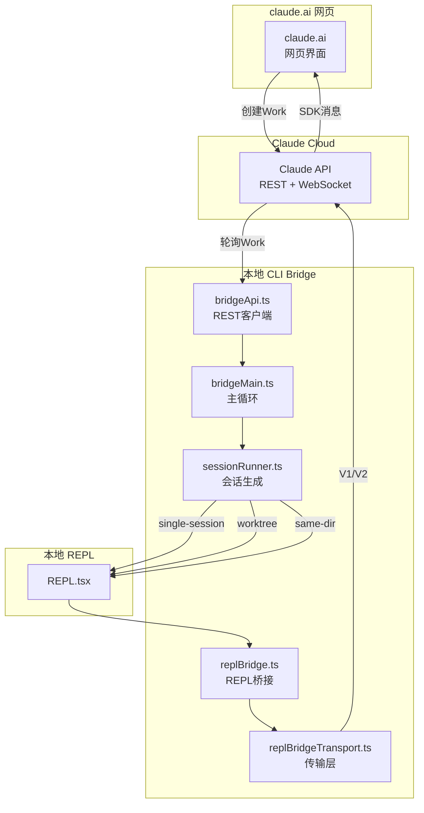

---

## 12. 构建系统架构图

展示 Bun 构建系统的架构。入口为 `src/entrypoints/cli.tsx`，通过 Bun Bundler 打包。构建过程中使用 Feature Flag Plugin（90+ flags）进行条件编译和 Dead Code Elimination，Text File Loader 处理 `.md`/`.txt`/`.d.ts` 等文本文件的字符串导入。原生模块（`.node`）、sharp 和 Anthropic SDK 作为外部依赖不打包。最终产出约 21MB 的 `dist/cli.js`，添加 shebang 并设置 0o755 权限。

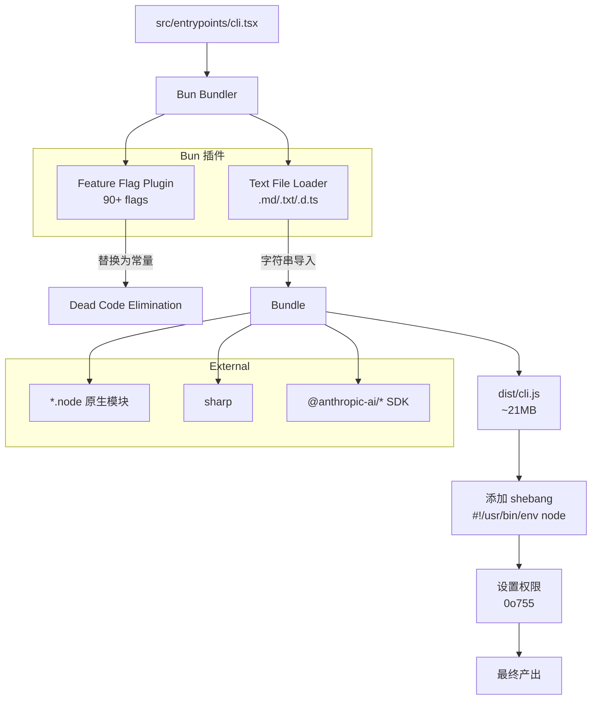
